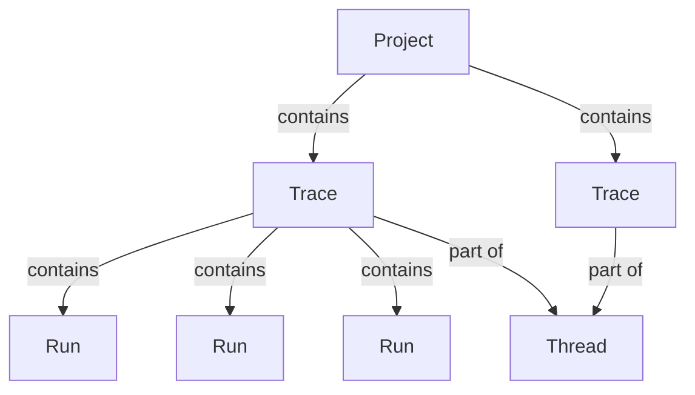

import MaxRunsPerTrace from '/snippets/langsmith/max-runs-per-trace.mdx';

LangSmith Observability lets you record, inspect, and analyze every step your LLM application takes. This page explains how data is structured in LangSmith and how to send traces.

## How LangSmith structures data

LangSmith groups multiple [_traces_](#traces) within a [_project_](#projects). Each trace records the sequence of steps your application takes for a single operation, which are made up of individual [_runs_](#runs). You can link together traces from multi-turn conversations as a [_thread_](#threads).

### Projects

A _project_ is a container for all the traces related to a single application or service.

[Log traces to a project](/langsmith/log-traces-to-project).

### Traces

A _trace_ is a collection of runs for a single operation. For example, if a user request triggers a chain that calls an LLM and then an output parser, all of those runs belong to the same trace. Runs are bound to a trace by a unique trace ID. If you are familiar with [OpenTelemetry](https://opentelemetry.io/), you can think of a LangSmith trace as a collection of spans.

<Note><MaxRunsPerTrace /></Note>

### Runs

A _run_ is a span representing a single unit of work within your LLM application: a call to an LLM, a prompt formatting step, a retrieval call, or any other discrete operation. If you are familiar with [OpenTelemetry](https://opentelemetry.io/), you can think of a run as a span.

### Threads

A _thread_ is a sequence of traces representing a single conversation. Each turn in a multi-turn conversation is its own trace, but traces are linked by a shared identifier. To group traces into threads, pass a special metadata key (`session_id`, `thread_id`, or `conversation_id`) with a unique value.

[Learn how to configure threads](/langsmith/threads).

<Callout type="info" icon="feather">
Use **[Polly](/langsmith/polly)** to analyze traces, runs, and threads. Polly helps you understand agent performance, debug issues, and gain insights from conversation threads without manually digging through data.
</Callout>

## Trace enrichment

### Feedback

_Feedback_ allows you to score an individual run based on certain criteria. Each feedback entry consists of a tag and a score, and is bound to a run by a unique run ID. Feedback can be continuous or discrete (categorical), and tags can be reused across runs within an organization.

For more on how feedback is stored, refer to the [Feedback data format guide](/langsmith/feedback-data-format).

### Tags

_Tags_ are strings you can attach to runs to categorize, filter, and group them in the LangSmith UI.

[Learn how to attach tags to your traces](/langsmith/add-metadata-tags).

### Metadata

_Metadata_ is a collection of key-value pairs you can attach to runs. For example, application version, environment, or any other contextual information. Similarly to tags, you can use metadata to filter and group runs.

[Learn how to add metadata to your traces](/langsmith/add-metadata-tags).

## Sending traces

There are two ways to send trace data to LangSmith.

### Integrations

LangSmith _integrations_ provide automatic tracing for popular LLM providers and agent frameworks (the equivalent of auto-instrumentation in general observability). When you use a supported framework such as LangChain, LangGraph, OpenAI, Anthropic, or CrewAI, the integration captures inputs, outputs, and metadata without requiring manual code changes.

[Browse all integrations](/langsmith/integrations).

### Manual instrumentation

_Manual instrumentation_ lets you add tracing to any code, regardless of the framework. Use it when you're not using a supported integration or when you need granular control over what gets traced. LangSmith provides three mechanisms:

- `@traceable` / `traceable`: a decorator to trace any function
- `trace` context manager (Python): wrap specific code blocks
- `RunTree` API: low-level, explicit trace construction

[Learn how to add manual instrumentation](/langsmith/annotate-code).

## Data retention

LangSmith (SaaS) retains trace data for 400 days from ingestion. After that, traces are permanently deleted, with limited metadata retained for usage statistics. For details on retention tiers and pricing, refer to [Usage and billing: Data retention](/langsmith/administration-overview#data-retention).

<Note>
To keep data beyond the retention period, add it to a [dataset](/langsmith/manage-datasets). Datasets persist indefinitely, even after the source trace is deleted.
</Note>

To delete traces before their expiration date, see [Manage a trace](/langsmith/manage-trace#delete-a-trace).

---

<Callout icon="edit">
    [Edit this page on GitHub](https://github.com/langchain-ai/docs/edit/main/src/langsmith/observability-concepts.mdx) or [file an issue](https://github.com/langchain-ai/docs/issues/new/choose).
</Callout>
<Callout icon="terminal-2">
    [Connect these docs](/use-these-docs) to Claude, VSCode, and more via MCP for real-time answers.
</Callout>

