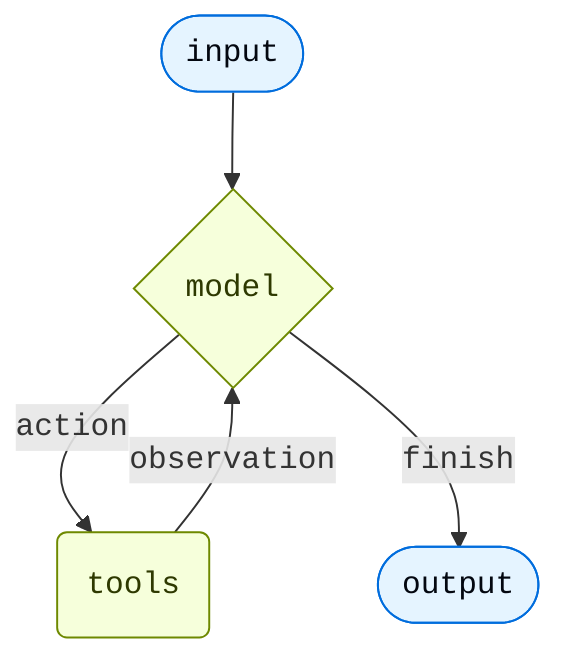

import AgentInvocationThreadAndContextJs from '/snippets/code-samples/agent-invocation-thread-and-context-js.mdx';
import AgentInvocationThreadAndContextPy from '/snippets/code-samples/agent-invocation-thread-and-context-py.mdx';
import AgentInvocationThreadIdJs from '/snippets/code-samples/agent-invocation-thread-id-js.mdx';
import AgentInvocationThreadIdPy from '/snippets/code-samples/agent-invocation-thread-id-py.mdx';

Agents combine language models with [tools](/oss/javascript/langchain/tools) to create systems that can reason about tasks, decide which tools to use, and iteratively work towards solutions.


`createAgent()` provides a production-ready agent implementation.


[An LLM Agent runs tools in a loop to achieve a goal](https://simonwillison.net/2025/Sep/18/agents/).
An agent runs until a stop condition is met - i.e., when the model emits a final output or an iteration limit is reached.



<Info>


`createAgent()` builds a **graph**-based agent runtime using [LangGraph](/oss/javascript/langgraph/overview). A graph consists of nodes (steps) and edges (connections) that define how your agent processes information. The agent moves through this graph, executing nodes like the model node (which calls the model), the tools node (which executes tools), or middleware.


Learn more about the [Graph API](/oss/javascript/langgraph/graph-api).

</Info>

<Tip>
Trace each step of this loop, debug tool calls, and evaluate agent outputs with [LangSmith](https://smith.langchain.com?utm_source=docs&utm_medium=cta&utm_campaign=langsmith-signup&utm_content=oss-langchain-agents). Follow the [tracing quickstart](/langsmith/trace-with-langchain) to get set up.
</Tip>

<Note>
**agent = model + harness**

The job of a harness: get the model the right context at the right time for the given task.
</Note>

The harness is everything wrapped around that loop. For a simple task the harness is trivial. But agents that do complex work need more.

<CardGroup cols={2}>
  <Card title="Execution environment" icon="bolt" href="#execution-environment">
    Tools, filesystem, sandboxes, and code execution
  </Card>
  <Card title="Context management" icon="database" href="#context-management">
    Summarization, memory, skills, and prompt caching
  </Card>
  <Card title="Planning and delegation" icon="sitemap" href="#planning-and-delegation">
    Todo lists and subagents for parallel, isolated work
  </Card>
  <Card title="Fault tolerance" icon="shield" href="#fault-tolerance">
    Retries, fallbacks, and call limits
  </Card>
  <Card title="Guardrails" icon="lock" href="#guardrails">
    PII detection and content controls
  </Card>
  <Card title="Steering" icon="user" href="#steering">
    Human-in-the-loop approval before high-impact actions
  </Card>
</CardGroup>

[`create_agent`](https://reference.langchain.com/javascript/langchain/index/createAgent) is the minimal harness: a model, a set of tools, a loop.


```typescript
import { createAgent } from "langchain";

const agent = createAgent({ model: "openai:gpt-5.4", tools });
```


You extend it through two levers:

- **Arguments**: `tools=` and `system_prompt=` wire in capabilities directly.
- **Middleware**: each middleware bundles its own tools, prompt additions, and loop hooks into a composable unit. Pass one or more to `middleware=` to extend the harness. See [Middleware overview](/oss/javascript/langchain/middleware/overview).

Design the harness around your use case: start with a clear prompt, then connect the agent tightly to the data and environment the task needs. A research agent connects to search tools, a filesystem for findings, and summarization for long runs. A coding agent needs filesystem access, a sandbox, and human-in-the-loop gates for risky writes.

## Core components

### Model

Pass a model identifier string (`"provider:model"`) or an initialized model instance. See [Models](/oss/javascript/langchain/models) for parameters, provider setup, and dynamic model selection.


```typescript
import { createAgent } from "langchain";

const agent = createAgent({ model: "openai:gpt-5.4", tools });
```


### Tools

Pass any Python callable, LangChain tool, or tool dict. See [Tools](/oss/javascript/langchain/tools) for tool definition, context access, and dynamic tool selection.


```typescript
import { createAgent, tool } from "langchain";
import * as z from "zod";

const search = tool(({ query }) => `Results for: ${query}`, {
  name: "search",
  description: "Search for information",
  schema: z.object({ query: z.string() }),
});

const agent = createAgent({ model: "openai:gpt-5.4", tools: [search] });
```


### System prompt

Shape how the agent approaches tasks. Accepts a string or `SystemMessage`. For dynamic prompts at runtime, use [middleware](/oss/javascript/langchain/middleware).


```typescript
const agent = createAgent({
  model: "openai:gpt-5.4",
  tools,
  systemPrompt: "You are a helpful assistant. Be concise and accurate.",
});
```


### Structured output

Return a validated schema from the agent using `response_format=`. See [Structured output](/oss/javascript/langchain/structured-output) for strategies and examples.


```typescript
import * as z from "zod";

const Answer = z.object({ summary: z.string(), confidence: z.number() });

const agent = createAgent({ model: "openai:gpt-5.4", tools, responseFormat: Answer });
const result = await agent.invoke({ messages: [{ role: "user", content: "Summarize AI trends" }] });
result.structuredResponse; // { summary: ..., confidence: ... }
```


### Name

Optional identifier used as the node name when embedding this agent as a subgraph in [multi-agent](/oss/javascript/langchain/multi-agent) systems.


```typescript
const agent = createAgent({ model: "openai:gpt-5.4", tools, name: "research_assistant" });
```


## Invocation


You can invoke an agent by passing an update to its [`State`](/oss/javascript/langgraph/graph-api#state). All agents include a [sequence of messages](/oss/javascript/langgraph/use-graph-api#messagesvalue) in their state; to invoke the agent, pass a new message along with a `thread_id` so the agent can persist and resume conversation history:


<AgentInvocationThreadIdJs />


<Note>
Persisting conversation history with `thread_id` requires the agent to be configured with a [checkpointer](/oss/javascript/langchain/long-term-memory). When deployed on [LangSmith](/langsmith/deployment), a checkpointer is provisioned automatically. Locally, pass one explicitly, for example `create_agent(..., checkpointer=InMemorySaver())`.
</Note>


If you also need to pass per-run configuration (such as a user ID, API keys, or feature flags) to tools and middleware, pass it as `context` alongside the config. Define the shape of that data with `contextSchema` and access it through `runtime.context`:

<AgentInvocationThreadAndContextJs />

`thread_id` scopes the *conversation* (message history, checkpoints), while `context` carries *per-run* data your tools and middleware read at invocation time. Both are commonly passed together. See [tool context](/oss/javascript/langchain/tools#context) and [Runtime](/oss/javascript/langchain/runtime) for more.


### Streaming

We've seen how the agent can be called with `invoke` to get a final response. If the agent executes multiple steps, this may take a while. To show intermediate progress, we can stream back messages as they occur.


```ts
const stream = await agent.stream(
  {
    messages: [{
      role: "user",
      content: "Search for AI news and summarize the findings"
    }],
  },
  { streamMode: "values" }
);

for await (const chunk of stream) {
  // Each chunk contains the full state at that point
  const latestMessage = chunk.messages.at(-1);
  if (latestMessage?.content) {
    console.log(`Agent: ${latestMessage.content}`);
  } else if (latestMessage?.tool_calls) {
    const toolCallNames = latestMessage.tool_calls.map((tc) => tc.name);
    console.log(`Calling tools: ${toolCallNames.join(", ")}`);
  }
}
```


<Tip>
For more details on streaming, see [Streaming](/oss/javascript/langchain/streaming).
</Tip>

## Configure the harness

### Execution environment

The execution environment is where the agent takes action. Tools give the model a set of callable actions: any function, API, or database query. The filesystem extends those actions across turns, letting the agent read, write, and organize files as it works. Sandboxes and interpreters add code execution: sandboxes for isolated shell access, a QuickJS interpreter for lightweight in-process scripting.

| Capability | How to add | In `create_deep_agent` |
|---|---|---|
| **Tools**: functions, APIs, databases | `tools=` on `create_agent` | ✓ via `tools=` |
| **Virtual filesystem**: files persisted across turns | [`FilesystemMiddleware`](https://reference.langchain.com/javascript/deepagents/middleware/createFilesystemMiddleware) | ✓ |
| **REPL**: in-process scripting (QuickJS) | [`CodeInterpreterMiddleware`](/oss/javascript/deepagents/interpreters) | — |
| **Shell**: shared working directory across turns | @[`ShellToolMiddleware`] | — |
| **Sandbox**: code execution isolated from the host | [`SandboxBackend`](/oss/javascript/deepagents/sandboxes) | — |


```typescript
import { createAgent } from "langchain";
import { FilesystemMiddleware, StateBackend } from "deepagents";

const agent = createAgent({
  model: "anthropic:claude-sonnet-4-6",
  tools: [search, fetchUrl],
  middleware: [  // add what your use case needs
    new FilesystemMiddleware({ backend: new StateBackend() }),
  ],
});
```


### Context management

Context management has three jobs: optimize what's in the context window at any given turn, prevent overflow and context rot as the run grows, and improve what the agent knows across sessions.

| Capability | How to add | In `create_deep_agent` |
|---|---|---|
| **Summarization**: compresses history and offloads large results | [`SummarizationMiddleware`](https://reference.langchain.com/javascript/langchain/index/summarizationMiddleware) | ✓ |
| **Summarization tool**: agent controls when to compress | [`SummarizationToolMiddleware`](https://reference.langchain.com/javascript/deepagents/middleware/createSummarizationMiddleware) | — |
| **Memory**: AGENTS.md instructions loaded at startup | [`MemoryMiddleware`](https://reference.langchain.com/javascript/deepagents/middleware/createMemoryMiddleware) | ✓ if `memory=` |
| **Skills**: domain knowledge loaded progressively | [`SkillsMiddleware`](https://reference.langchain.com/javascript/deepagents/middleware/createSkillsMiddleware) | ✓ if `skills=` |
| **Prompt caching**: reuses static prompt sections (Anthropic) | [`AnthropicPromptCachingMiddleware`](https://reference.langchain.com/javascript/langchain/index/anthropicPromptCachingMiddleware) | ✓ Anthropic |
| **Dynamic tools**: trims tool list per model call | @[`LLMToolSelectorMiddleware`] | — |


```typescript
import { createAgent } from "langchain";
import {
  FilesystemMiddleware,
  MemoryMiddleware,
  SkillsMiddleware,
  SummarizationMiddleware,
  StateBackend,
} from "deepagents";

const backend = new StateBackend();
const model = "anthropic:claude-sonnet-4-6";

const agent = createAgent({
  model,
  tools: [search],
  middleware: [  // add what your use case needs
    new FilesystemMiddleware({ backend }),
    new SummarizationMiddleware({ model, backend }),
    new MemoryMiddleware({ backend, sources: ["./AGENTS.md"] }),
    new SkillsMiddleware({ backend, sources: ["./skills/"] }),
  ],
});
```


### Planning and delegation

Some tasks are too large or too parallel for a single context window. Delegation lets the main agent hand off focused subtasks to subagents. Each runs independently in its own context window and returns a single result, keeping the main agent's context clean and enabling parallel execution.

| Capability | How to add | In `create_deep_agent` |
|---|---|---|
| **Todo list**: structured task tracking across turns | [`TodoListMiddleware`](https://reference.langchain.com/javascript/langchain/index/todoListMiddleware) | ✓ |
| **Subagents**: isolated subtasks in their own context windows | [`SubAgentMiddleware`](https://reference.langchain.com/javascript/deepagents/middleware/createSubAgentMiddleware) | ✓ |
| **Async subagents**: fire-and-forget tasks the main agent doesn't wait on | [`AsyncSubAgentMiddleware`](https://reference.langchain.com/javascript/deepagents/agent/createDeepAgent) | — |


```typescript
import { createAgent, TodoListMiddleware } from "langchain";
import {
  FilesystemMiddleware,
  MemoryMiddleware,
  SkillsMiddleware,
  SubAgentMiddleware,
  SummarizationMiddleware,
  StateBackend,
} from "deepagents";

const backend = new StateBackend();
const model = "anthropic:claude-sonnet-4-6";

const researcher = {
  name: "researcher",
  description: "Deep-dives into a topic and returns a structured summary.",
  systemPrompt: "You are a research specialist. Search thoroughly and cite your sources.",
  tools: [search],
};

const agent = createAgent({
  model,
  tools: [search],
  middleware: [
    new FilesystemMiddleware({ backend }),
    new SummarizationMiddleware({ model, backend }),
    new MemoryMiddleware({ backend, sources: ["./AGENTS.md"] }),
    new SkillsMiddleware({ backend, sources: ["./skills/"] }),
    new TodoListMiddleware(),
    new SubAgentMiddleware({ backend, subagents: [researcher] }),
  ],
});
```


### Fault tolerance

Production agents encounter failures that dev environments don't: rate limits, model timeouts, transient tool errors. These middleware handle failure at the infrastructure level so your tools and business logic stay clean.

| Capability | How to add | In `create_deep_agent` |
|---|---|---|
| **Model retry**: retries on transient model failures | [`ModelRetryMiddleware`](https://reference.langchain.com/javascript/langchain/index/modelRetryMiddleware) | — |
| **Tool retry**: retries on rate limits or transient tool errors | [`ToolRetryMiddleware`](https://reference.langchain.com/javascript/langchain/index/toolRetryMiddleware) | — |
| **Model fallback**: switches to an alternate model on failure | [`ModelFallbackMiddleware`](https://reference.langchain.com/javascript/langchain/index/modelFallbackMiddleware) | — |
| **Model call cap**: bounds total model calls per session | [`ModelCallLimitMiddleware`](https://reference.langchain.com/javascript/langchain/index/modelCallLimitMiddleware) | — |
| **Tool call cap**: bounds total tool calls per session | [`ToolCallLimitMiddleware`](https://reference.langchain.com/javascript/langchain/index/toolCallLimitMiddleware) | — |


```typescript
import { createAgent, ModelRetryMiddleware, ToolRetryMiddleware } from "langchain";

const agent = createAgent({
  model: "anthropic:claude-sonnet-4-6",
  tools: [search],
  middleware: [
    new ModelRetryMiddleware({ maxRetries: 3 }),
    new ToolRetryMiddleware({ maxRetries: 2 }),
  ],
});
```


### Guardrails

Guardrails intercept data as it flows through the agent loop, enforcing compliance or content policies before tool results reach the model's context.

| Capability | How to add | In `create_deep_agent` |
|---|---|---|
| **PII detection**: redacts personal data from tool results before they enter the context | @[`PIIMiddleware`] | — |

### Steering

Fully autonomous agents aren't always the right call. Steering lets you pause execution before specific tool calls (destructive writes, expensive API calls, anything requiring human judgment) so a human can approve, edit, or reject before the agent proceeds.

| Capability | How to add | In `create_deep_agent` |
|---|---|---|
| **Human-in-the-loop**: pause for approval before specified tool calls | [`HumanInTheLoopMiddleware`](https://reference.langchain.com/javascript/langchain/middleware/humanInTheLoopMiddleware) | ✓ if `interrupt_on=` |


```typescript
import { createAgent, HumanInTheLoopMiddleware, TodoListMiddleware } from "langchain";
import {
  FilesystemMiddleware,
  MemoryMiddleware,
  SkillsMiddleware,
  SubAgentMiddleware,
  SummarizationMiddleware,
  StateBackend,
} from "deepagents";

const backend = new StateBackend();
const model = "anthropic:claude-sonnet-4-6";

const researcher = {
  name: "researcher",
  description: "Deep-dives into a topic and returns a structured summary.",
  systemPrompt: "You are a research specialist. Search thoroughly and cite your sources.",
  tools: [search],
};

const agent = createAgent({
  model,
  tools: [search],
  middleware: [
    new FilesystemMiddleware({ backend }),
    new SummarizationMiddleware({ model, backend }),
    new MemoryMiddleware({ backend, sources: ["./AGENTS.md"] }),
    new SkillsMiddleware({ backend, sources: ["./skills/"] }),
    new TodoListMiddleware(),
    new SubAgentMiddleware({ backend, subagents: [researcher] }),
    new HumanInTheLoopMiddleware({ interruptOn: { writeFile: true } }),
  ],
});
```


<Tip>
`create_deep_agent` pre-assembles this stack for long-running coding and research tasks (filesystem, summarization, subagents, and prompt caching included by default). See [Deep Agents](/oss/javascript/deepagents/harness) for the full pre-built harness.
</Tip>

**Middleware resources:**
- [Middleware overview](/oss/javascript/langchain/middleware/overview): how the middleware stack works and when hooks fire
- [Prebuilt middleware](/oss/javascript/langchain/middleware/built-in): full reference with configuration examples
- [Custom middleware](/oss/javascript/langchain/middleware/custom): write your own hooks for business logic, PII scrubbing, and more

## Advanced

### Memory

Agents maintain conversation history automatically through the message state. You can also configure the agent to use a custom state schema to remember additional information during the conversation.

Information stored in the state can be thought of as the [short-term memory](/oss/javascript/langchain/short-term-memory) of the agent:


```ts wrap
import { z } from "zod/v4";
import { StateSchema, MessagesValue } from "@langchain/langgraph";
import { createAgent } from "langchain";

const CustomAgentState = new StateSchema({
  messages: MessagesValue,
  userPreferences: z.record(z.string(), z.string()),
});

const customAgent = createAgent({
  model: "gpt-5.4",
  tools: [],
  stateSchema: CustomAgentState,
});
```


<Tip>
    To learn more about memory, see [Memory](/oss/javascript/concepts/memory). For information on implementing long-term memory that persists across sessions, see [Long-term memory](/oss/javascript/langchain/long-term-memory).
</Tip>

<Tip>
    To learn more about memory, see [Memory](/oss/javascript/concepts/memory). For information on implementing long-term memory that persists across sessions, see [Long-term memory](/oss/javascript/langchain/long-term-memory).
</Tip>

---

<div className="source-links">
<Callout icon="terminal-2">
    [Connect these docs](/use-these-docs) to Claude, VSCode, and more via MCP for real-time answers.
</Callout>
<Callout icon="edit">
    [Edit this page on GitHub](https://github.com/langchain-ai/docs/edit/main/src/oss/langchain/agents.mdx) or [file an issue](https://github.com/langchain-ai/docs/issues/new/choose).
</Callout>
</div>
