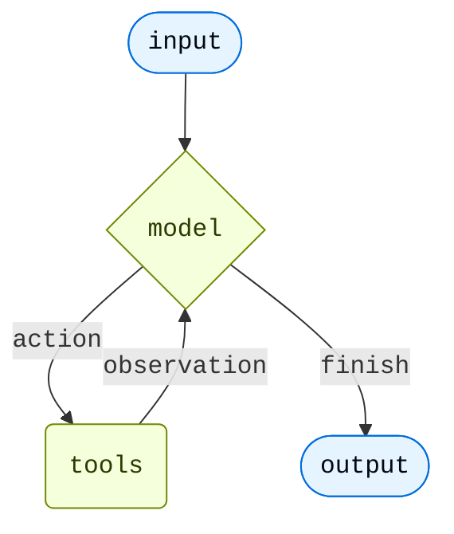

<Note>
**agent = model + harness**

The job of a harness: get the model the right context at the right time for the given task.
</Note>

At its core, an agent is a model calling tools in a loop until the task is complete.

The harness is everything wrapped around that loop. For a simple task the harness is trivial. But agents that do real work need more.

<CardGroup cols={2}>
  <Card title="Act in an environment" icon="bolt">
    Take actions via tools, read and write files, execute code
  </Card>
  <Card title="Connect to your data" icon="database">
    Load memories, skills, and domain knowledge at the right moment
  </Card>
  <Card title="Manage growing context" icon="scissors">
    Summarize history and offload large results across long runs
  </Card>
  <Card title="Parallelize tasks" icon="sitemap">
    Delegate to specialized subagents running in isolated context windows
  </Card>
  <Card title="Stay in the loop" icon="user">
    Pause for human approval at critical decision points
  </Card>
  <Card title="Improve over time" icon="rocket">
    Update memory, skills, and prompts based on real usage
  </Card>
</CardGroup>

[`create_agent`][langchain.agents.create_agent] is the minimal harness—a model calling tools in a loop. You extend it by adding [middleware](/oss/javascript/langchain/middleware/overview): each middleware hooks into one stage of the loop and adds one capability without changing the harness itself.

Not every agent needs every capability. Design the harness around what your application does. A research agent needs search tools, a filesystem to persist findings, and summarization to stay coherent across long runs. A coding agent needs filesystem access, a sandbox for safe execution, and human-in-the-loop for risky writes. A customer support agent needs memory for user preferences and HITL for escalations.

Two levers configure the harness:

- **Arguments to `create_agent`** — `tools=`, `system_prompt=`, and `checkpointer=` wire in static capabilities directly.
- **Middleware** — each middleware bundles its own tools, prompt additions, and loop hooks into a single composable unit. Pass one or more to `middleware=` to extend the harness. See [Middleware overview](/oss/javascript/langchain/middleware/overview).

---

## Execution environment

Tools are the agent's primary interface to the world—any function, API, or database query becomes an action the model can call. The filesystem gives the agent persistent working storage across turns. When the agent needs to execute code, a sandbox provides host isolation; a QuickJS interpreter provides a lighter alternative for data transformation and programmatic tool orchestration.

| Capability | How to add | In `create_deep_agent` |
|---|---|---|
| **Custom tools**—functions, APIs, databases your agent can call | `tools=` on `create_agent` | ✓ via `tools=` |
| **Virtual filesystem**—read and write files that persist across turns | [`FilesystemMiddleware`](https://reference.langchain.com/javascript/deepagents/middleware/createFilesystemMiddleware) | ✓ |
| **JavaScript REPL**—batch tool calls or transform data in-process (QuickJS) | [`CodeInterpreterMiddleware`](/oss/javascript/deepagents/interpreters) | — |
| **Persistent shell**—commands sharing a working directory across turns | @[`ShellToolMiddleware`] | — |
| **Isolated sandbox**—install packages and run code without touching the host | [`SandboxBackend`](/oss/javascript/deepagents/sandboxes) | — |

---

## Context management

Long-running agents accumulate context they no longer need and eventually hit token limits. Context management controls what goes into the model's context window at each turn—compressing history that's no longer needed, loading instructions that are always relevant, surfacing domain knowledge only when the current task calls for it, and reusing cached static sections to reduce cost.

| Capability | How to add | In `create_deep_agent` |
|---|---|---|
| **History compression**—keeps context lean for tasks running 10+ turns or producing large tool results | [`SummarizationMiddleware`](https://reference.langchain.com/javascript/langchain/index/summarizationMiddleware) | ✓ |
| **Agent-triggered summarization**—agent decides when to compress, e.g., between tasks | [`SummarizationToolMiddleware`](https://reference.langchain.com/javascript/deepagents/middleware/createSummarizationMiddleware) | — |
| **Persistent memory** via `AGENTS.md`—preferences and guidelines loaded at startup | [`MemoryMiddleware`](https://reference.langchain.com/javascript/deepagents/middleware/createMemoryMiddleware) | ✓ if `memory=` |
| **On-demand skills**—domain knowledge loaded only when the agent needs it | [`SkillsMiddleware`](https://reference.langchain.com/javascript/deepagents/middleware/createSkillsMiddleware) | ✓ if `skills=` |
| **Prompt caching**—reduces cost on repeated static prompt sections (Anthropic) | [`AnthropicPromptCachingMiddleware`](https://reference.langchain.com/javascript/langchain/index/anthropicPromptCachingMiddleware) | ✓ Anthropic |
| **Dynamic tool filtering**—trims tool list before each model call | @[`LLMToolSelectorMiddleware`] | — |

---

## Planning and delegation

Some tasks are too large or too parallel for a single context window. Delegation lets the main agent hand off focused subtasks to subagents—each runs independently in its own context window and returns a single result, keeping the main agent's context clean and enabling parallel execution.

| Capability | How to add | In `create_deep_agent` |
|---|---|---|
| **Todo list**—structured task tracking across turns | [`TodoListMiddleware`](https://reference.langchain.com/javascript/langchain/index/todoListMiddleware) | ✓ |
| **Sync subagents**—isolated subtasks in their own context windows | [`SubAgentMiddleware`](https://reference.langchain.com/javascript/deepagents/middleware/createSubAgentMiddleware) | ✓ |
| **Background subagents**—fire-and-forget tasks the main agent doesn't wait on | [`AsyncSubAgentMiddleware`](https://reference.langchain.com/javascript/deepagents/agent/createDeepAgent) | — |

---

## Fault tolerance

Production agents encounter failures that dev environments don't—rate limits, model timeouts, transient tool errors. These middleware handle failure at the infrastructure level so your tools and business logic stay clean.

| Capability | How to add | In `create_deep_agent` |
|---|---|---|
| **Model retry**—retries on transient model failures | [`ModelRetryMiddleware`](https://reference.langchain.com/javascript/langchain/index/modelRetryMiddleware) | — |
| **Tool retry**—retries on rate limits or transient tool errors | [`ToolRetryMiddleware`](https://reference.langchain.com/javascript/langchain/index/toolRetryMiddleware) | — |
| **Model fallback**—switches to an alternate model on failure | [`ModelFallbackMiddleware`](https://reference.langchain.com/javascript/langchain/index/modelFallbackMiddleware) | — |
| **Model call cap**—bounds total model calls per session | [`ModelCallLimitMiddleware`](https://reference.langchain.com/javascript/langchain/index/modelCallLimitMiddleware) | — |
| **Tool call cap**—bounds total tool calls per session | [`ToolCallLimitMiddleware`](https://reference.langchain.com/javascript/langchain/index/toolCallLimitMiddleware) | — |

---

## Guardrails

Guardrails intercept data as it flows through the agent loop, enforcing compliance or content policies before tool results reach the model's context.

| Capability | How to add | In `create_deep_agent` |
|---|---|---|
| **PII detection**—redacts personal data from tool results before they enter the context | @[`PIIMiddleware`] | — |

---

## Steering

Fully autonomous agents aren't always the right call. Steering lets you pause execution before specific tool calls—destructive writes, expensive API calls, anything requiring human judgment—so a human can approve, edit, or reject before the agent proceeds. State is persisted via a checkpointer while waiting for input.

| Capability | How to add | In `create_deep_agent` |
|---|---|---|
| **Human-in-the-loop**—pause for approval before specified tool calls | [`HumanInTheLoopMiddleware`](https://reference.langchain.com/javascript/langchain/middleware/humanInTheLoopMiddleware) | ✓ if `interrupt_on=` |

---

<Tip>
`create_deep_agent` pre-assembles this stack for long-running coding and research tasks—filesystem, summarization, subagents, and prompt caching included by default. See [Deep Agents](/oss/javascript/deepagents/harness) for the full pre-built harness.
</Tip>

**Middleware resources:**
- [Middleware overview](/oss/javascript/langchain/middleware/overview)—how the middleware stack works and when hooks fire
- [Prebuilt middleware](/oss/javascript/langchain/middleware/built-in)—full reference with configuration examples
- [Custom middleware](/oss/javascript/langchain/middleware/custom)—write your own hooks for business logic, PII scrubbing, and more

---

<Callout icon="terminal-2">
    [Connect these docs](/use-these-docs) to Claude, VSCode, and more via MCP for real-time answers.
</Callout>
<Callout icon="edit">
    [Edit this page on GitHub](https://github.com/langchain-ai/docs/edit/main/src/oss/langchain/harness.mdx) or [file an issue](https://github.com/langchain-ai/docs/issues/new/choose).
</Callout>

