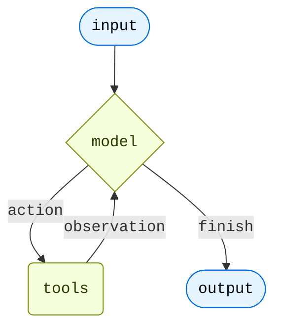

<Note>
**agent = model + harness**

The job of a harness: get the model the right context at the right time for the given task.
</Note>

At its core, an agent is a model calling tools in a loop until the task is complete.



The harness is everything wrapped around that loop. For a simple task the harness is trivial. But agents that do complex work need more.

<CardGroup cols={2}>
  <Card title="Execution environment" icon="bolt" href="#execution-environment">
    Tools, filesystem, sandboxes, and code execution
  </Card>
  <Card title="Context management" icon="database" href="#context-management">
    Summarization, memory, skills, and prompt caching
  </Card>
  <Card title="Planning and delegation" icon="sitemap" href="#planning-and-delegation">
    Todo lists and subagents for parallel, isolated work
  </Card>
  <Card title="Fault tolerance" icon="shield" href="#fault-tolerance">
    Retries, fallbacks, and call limits
  </Card>
  <Card title="Guardrails" icon="lock" href="#guardrails">
    PII detection and content controls
  </Card>
  <Card title="Steering" icon="user" href="#steering">
    Human-in-the-loop approval before high-impact actions
  </Card>
</CardGroup>

[`create_agent`](https://reference.langchain.com/python/langchain/agents/factory/create_agent) is the minimal harness—a model, a set of tools, a loop:

```python
from langchain.agents import create_agent

agent = create_agent("openai:gpt-5.4", tools=tools)
```


You extend it through two levers:

- **Arguments** — `tools=` and `system_prompt=` wire in capabilities directly.
- **Middleware** — each middleware bundles its own tools, prompt additions, and loop hooks into a composable unit. Pass one or more to `middleware=` to extend the harness. See [Middleware overview](/oss/python/langchain/middleware/overview).

Design the harness around your use case: start with a clear prompt, then connect the agent tightly to the data and environment the task needs. A research agent connects to search tools, a filesystem for findings, and summarization for long runs. A coding agent needs filesystem access, a sandbox, and human-in-the-loop gates for risky writes.

---

## Execution environment

The execution environment is where the agent takes action. Tools give the model a set of callable actions—any function, API, or database query. The filesystem extends those actions across turns, letting the agent read, write, and organize files as it works. Sandboxes and interpreters add code execution: sandboxes for isolated shell access, a QuickJS interpreter for lightweight in-process scripting.

| Capability | How to add | In `create_deep_agent` |
|---|---|---|
| **Tools**—functions, APIs, databases | `tools=` on `create_agent` | ✓ via `tools=` |
| **Virtual filesystem**—files persisted across turns | [`FilesystemMiddleware`](https://reference.langchain.com/python/deepagents/middleware/filesystem/FilesystemMiddleware) | ✓ |
| **REPL**—in-process scripting (QuickJS) | [`CodeInterpreterMiddleware`](/oss/python/deepagents/interpreters) | — |
| **Shell**—shared working directory across turns | [`ShellToolMiddleware`](https://reference.langchain.com/python/langchain/agents/middleware/shell_tool/ShellToolMiddleware) | — |
| **Sandbox**—code execution isolated from the host | [`SandboxBackend`](/oss/python/deepagents/sandboxes) | — |

```python
from langchain.agents import create_agent
from deepagents.backends import StateBackend
from deepagents.middleware import FilesystemMiddleware

agent = create_agent(
    model="anthropic:claude-sonnet-4-6",
    tools=[search, fetch_url],
    middleware=[  # add what your use case needs
        FilesystemMiddleware(backend=StateBackend()),
    ],
)
```


---

## Context management

Context management has three jobs: optimize what's in the context window at any given turn, prevent overflow and context rot as the run grows, and improve what the agent knows across sessions.

| Capability | How to add | In `create_deep_agent` |
|---|---|---|
| **Summarization**—compresses history and offloads large results | [`SummarizationMiddleware`](https://reference.langchain.com/python/langchain/agents/middleware/summarization/SummarizationMiddleware) | ✓ |
| **Summarization tool**—agent controls when to compress | [`SummarizationToolMiddleware`](https://reference.langchain.com/python/deepagents/middleware/summarization/SummarizationToolMiddleware) | — |
| **Memory**—AGENTS.md instructions loaded at startup | [`MemoryMiddleware`](https://reference.langchain.com/python/deepagents/middleware/memory/MemoryMiddleware) | ✓ if `memory=` |
| **Skills**—domain knowledge loaded progressively | [`SkillsMiddleware`](https://reference.langchain.com/python/deepagents/middleware/skills/SkillsMiddleware) | ✓ if `skills=` |
| **Prompt caching**—reuses static prompt sections (Anthropic) | [`AnthropicPromptCachingMiddleware`](https://reference.langchain.com/python/langchain-anthropic/middleware/prompt_caching/AnthropicPromptCachingMiddleware) | ✓ Anthropic |
| **Dynamic tools**—trims tool list per model call | [`LLMToolSelectorMiddleware`](https://reference.langchain.com/python/langchain/agents/middleware/tool_selection/LLMToolSelectorMiddleware) | — |

```python
from langchain.agents import create_agent
from deepagents.backends import StateBackend
from deepagents.middleware import (
    FilesystemMiddleware,
    MemoryMiddleware,
    SkillsMiddleware,
    SummarizationMiddleware,
)

backend = StateBackend()
model = "anthropic:claude-sonnet-4-6"

agent = create_agent(
    model=model,
    tools=[search],
    middleware=[  # add what your use case needs
        FilesystemMiddleware(backend=backend),
        SummarizationMiddleware(model=model, backend=backend),
        MemoryMiddleware(backend=backend, sources=["./AGENTS.md"]),
        SkillsMiddleware(backend=backend, sources=["./skills/"]),
    ],
)
```


---

## Planning and delegation

Some tasks are too large or too parallel for a single context window. Delegation lets the main agent hand off focused subtasks to subagents—each runs independently in its own context window and returns a single result, keeping the main agent's context clean and enabling parallel execution.

| Capability | How to add | In `create_deep_agent` |
|---|---|---|
| **Todo list**—structured task tracking across turns | [`TodoListMiddleware`](https://reference.langchain.com/python/langchain/agents/middleware/todo/TodoListMiddleware) | ✓ |
| **Subagents**—isolated subtasks in their own context windows | [`SubAgentMiddleware`](https://reference.langchain.com/python/deepagents/middleware/subagents/SubAgentMiddleware) | ✓ |
| **Async subagents**—fire-and-forget tasks the main agent doesn't wait on | [`AsyncSubAgentMiddleware`](https://reference.langchain.com/python/deepagents/middleware/async_subagents/AsyncSubAgentMiddleware) | — |

```python
from langchain.agents import create_agent
from langchain.agents.middleware import TodoListMiddleware
from deepagents import SubAgent
from deepagents.backends import StateBackend
from deepagents.middleware import (
    FilesystemMiddleware,
    MemoryMiddleware,
    SkillsMiddleware,
    SubAgentMiddleware,
    SummarizationMiddleware,
)

backend = StateBackend()
model = "anthropic:claude-sonnet-4-6"

researcher: SubAgent = {
    "name": "researcher",
    "description": "Deep-dives into a topic and returns a structured summary.",
    "system_prompt": "You are a research specialist. Search thoroughly and cite your sources.",
    "tools": [search],
}

agent = create_agent(
    model=model,
    tools=[search],
    middleware=[
        FilesystemMiddleware(backend=backend),
        SummarizationMiddleware(model=model, backend=backend),
        MemoryMiddleware(backend=backend, sources=["./AGENTS.md"]),
        SkillsMiddleware(backend=backend, sources=["./skills/"]),
        TodoListMiddleware(),
        SubAgentMiddleware(backend=backend, subagents=[researcher]),
    ],
)
```


---

## Fault tolerance

Production agents encounter failures that dev environments don't—rate limits, model timeouts, transient tool errors. These middleware handle failure at the infrastructure level so your tools and business logic stay clean.

| Capability | How to add | In `create_deep_agent` |
|---|---|---|
| **Model retry**—retries on transient model failures | [`ModelRetryMiddleware`](https://reference.langchain.com/python/langchain/agents/middleware/model_retry/ModelRetryMiddleware) | — |
| **Tool retry**—retries on rate limits or transient tool errors | [`ToolRetryMiddleware`](https://reference.langchain.com/python/langchain/agents/middleware/tool_retry/ToolRetryMiddleware) | — |
| **Model fallback**—switches to an alternate model on failure | [`ModelFallbackMiddleware`](https://reference.langchain.com/python/langchain/agents/middleware/model_fallback/ModelFallbackMiddleware) | — |
| **Model call cap**—bounds total model calls per session | [`ModelCallLimitMiddleware`](https://reference.langchain.com/python/langchain/agents/middleware/model_call_limit/ModelCallLimitMiddleware) | — |
| **Tool call cap**—bounds total tool calls per session | [`ToolCallLimitMiddleware`](https://reference.langchain.com/python/langchain/agents/middleware/tool_call_limit/ToolCallLimitMiddleware) | — |

```python
from langchain.agents import create_agent
from langchain.agents.middleware import ModelRetryMiddleware, ToolRetryMiddleware

agent = create_agent(
    model="anthropic:claude-sonnet-4-6",
    tools=[search],
    middleware=[
        ModelRetryMiddleware(max_retries=3),
        ToolRetryMiddleware(max_retries=2),
    ],
)
```


---

## Guardrails

Guardrails intercept data as it flows through the agent loop, enforcing compliance or content policies before tool results reach the model's context.

| Capability | How to add | In `create_deep_agent` |
|---|---|---|
| **PII detection**—redacts personal data from tool results before they enter the context | [`PIIMiddleware`](https://reference.langchain.com/python/langchain/agents/middleware/pii/PIIMiddleware) | — |

---

## Steering

Fully autonomous agents aren't always the right call. Steering lets you pause execution before specific tool calls—destructive writes, expensive API calls, anything requiring human judgment—so a human can approve, edit, or reject before the agent proceeds.

| Capability | How to add | In `create_deep_agent` |
|---|---|---|
| **Human-in-the-loop**—pause for approval before specified tool calls | [`HumanInTheLoopMiddleware`](https://reference.langchain.com/python/langchain/agents/middleware/human_in_the_loop/HumanInTheLoopMiddleware) | ✓ if `interrupt_on=` |

```python
from langchain.agents import create_agent
from langchain.agents.middleware import HumanInTheLoopMiddleware, TodoListMiddleware
from deepagents import SubAgent
from deepagents.backends import StateBackend
from deepagents.middleware import (
    FilesystemMiddleware,
    MemoryMiddleware,
    SkillsMiddleware,
    SubAgentMiddleware,
    SummarizationMiddleware,
)

backend = StateBackend()
model = "anthropic:claude-sonnet-4-6"

researcher: SubAgent = {
    "name": "researcher",
    "description": "Deep-dives into a topic and returns a structured summary.",
    "system_prompt": "You are a research specialist. Search thoroughly and cite your sources.",
    "tools": [search],
}

agent = create_agent(
    model=model,
    tools=[search],
    middleware=[
        FilesystemMiddleware(backend=backend),
        SummarizationMiddleware(model=model, backend=backend),
        MemoryMiddleware(backend=backend, sources=["./AGENTS.md"]),
        SkillsMiddleware(backend=backend, sources=["./skills/"]),
        TodoListMiddleware(),
        SubAgentMiddleware(backend=backend, subagents=[researcher]),
        HumanInTheLoopMiddleware(interrupt_on={"write_file": True}),
    ],
)
```


---

<Tip>
`create_deep_agent` pre-assembles this stack for long-running coding and research tasks—filesystem, summarization, subagents, and prompt caching included by default. See [Deep Agents](/oss/python/deepagents/harness) for the full pre-built harness.
</Tip>

**Middleware resources:**
- [Middleware overview](/oss/python/langchain/middleware/overview)—how the middleware stack works and when hooks fire
- [Prebuilt middleware](/oss/python/langchain/middleware/built-in)—full reference with configuration examples
- [Custom middleware](/oss/python/langchain/middleware/custom)—write your own hooks for business logic, PII scrubbing, and more

---

<div className="source-links">
<Callout icon="terminal-2">
    [Connect these docs](/use-these-docs) to Claude, VSCode, and more via MCP for real-time answers.
</Callout>
<Callout icon="edit">
    [Edit this page on GitHub](https://github.com/langchain-ai/docs/edit/main/src/oss/langchain/harness.mdx) or [file an issue](https://github.com/langchain-ai/docs/issues/new/choose).
</Callout>
</div>
