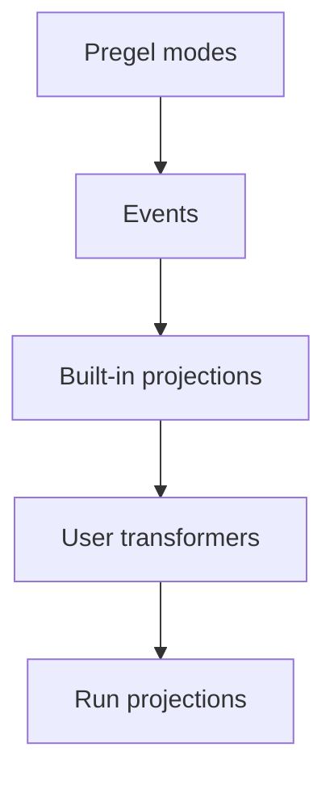

Event Streaming is the recommended in-process streaming model for most LangGraph application code. It returns a run stream object that can be consumed in multiple ways at the same time.

<Tip>
Check out the [streaming cookbook](https://github.com/langchain-ai/streaming-cookbook) for runnable examples and links to detailed reference documentation.
</Tip>

```python
run = graph.stream_events(
    {"messages": [{"role": "user", "content": "What is 42 * 17?"}]},
    version="v3",
)

for message in run.messages:
    for token in message.text:
        print(token, end="", flush=True)

final_state = run.output
```


<Note>
The `version="v3"` flag is temporarily required to opt in to this stream behavior. The new behavior will become the default stream version in the next major LangGraph release.
</Note>

## What Event Streaming provides

The run stream exposes typed projections over one underlying event flow:

| Projection | Use |
| ---------- | --- |
| `run` | Iterate every protocol event. |
| `run.messages` | Stream chat model messages and token deltas. |
| `run.values` | Iterate state snapshots and await the final value. |
| `run.output` | Await the final output. |
| `run.subgraphs` | Discover and observe nested graph executions. |
| `run.interrupts` | Inspect human-in-the-loop interrupt payloads. |
| `run.interrupted` | Check whether the run paused for human input. |
| `run.extensions` | Consume custom stream transformer projections. |

Multiple consumers can read these projections concurrently. Reading `run.messages` does not consume events needed by `run.values`, `run.subgraphs`, or `run.output`.

## Stream protocol events

Use the run object itself when you want the raw protocol event stream:

```python
run = graph.stream_events(input, version="v3")

for event in run:
    namespace = event["params"]["namespace"]
    print(namespace, event["method"], event["params"]["data"])
```


Each protocol event has a channel-like `method`, a monotonic `seq` number, and `params` containing `namespace`, `timestamp`, optional `node`, and channel-specific `data`.

```json
{
  "type": "event",
  "seq": 42,
  "method": "messages",
  "params": {
    "namespace": [],
    "timestamp": 1770000000000,
    "node": "agent",
    "data": {
      "event": "content-block-delta",
      "content_block": {
        "type": "text",
        "text": "hello"
      }
    }
  }
}
```

Core channels include:

| Channel | Purpose |
| ------- | ------- |
| `values` | Full graph state snapshots. |
| `updates` | Per-node state deltas. |
| `messages` | Content-block-centric chat model output. |
| `tools` | Tool call start, streamed output, finish, and error events. |
| `lifecycle` | Run, subgraph, and subagent status changes. |
| `checkpoints` | Lightweight checkpoint envelopes for branching and time travel. |
| `input` | Human-in-the-loop input requests and responses. |
| `tasks` | Pregel task creation and result events. |
| `custom` | User-defined payloads from graph code. |
| `custom:<name>` | Application-defined stream transformer output. |

The `messages` channel models output as content blocks. This makes token streaming, reasoning blocks, tool-call blocks, and multimodal content explicit without requiring provider-specific formats in application code.

## Add custom transformers

Stream transformers are the projection layer in Event Streaming. They observe protocol events, keep their own state, and expose derived views of a run such as progress events, artifacts, token totals, tool activity, or third-party protocol messages.



A transformer creates a projection in `init()`, observes each event in `process()`, and finalizes or fails the projection when the run completes.

```python
from langgraph.stream import ProtocolEvent, StreamTransformer


class MyTransformer(StreamTransformer):
    def init(self) -> dict:
        ...

    def process(self, event: ProtocolEvent) -> bool:
        ...

    def finalize(self) -> None:
        ...

    def fail(self, err: BaseException) -> None:
        ...
```


Pass transformers when you start the event stream:

```python
run = graph.stream_events(
    input,
    version="v3",
    transformers=[ToolActivityTransformer],
)

for activity in run.extensions["tool_activity"]:
    print(activity)
```


## Use StreamChannel

`StreamChannel` is the projection primitive for custom streaming data. It gives in-process consumers an iterable stream, and it can also forward pushed values to remote SDK clients when the channel has a protocol name.

| Need | Use |
| ---- | --- |
| Data should stay in process only | `StreamChannel()` or `new StreamChannel<T>()` |
| Data should be available in process and over the wire | `StreamChannel(name)` or `new StreamChannel<T>(name)` |

Named channel payloads must be serializable because they are also emitted as `custom:<name>` protocol events. Keep promises, async iterables, class instances, and other in-process handles local.

```python
from typing import TypedDict

from langgraph.stream import ProtocolEvent, StreamChannel, StreamTransformer


class ToolActivity(TypedDict):
    name: str
    status: str


class ToolActivityTransformer(StreamTransformer):
    required_stream_modes = ("tools",)

    def __init__(self, scope: tuple[str, ...] = ()) -> None:
        super().__init__(scope)
        self.activity = StreamChannel[ToolActivity]("tool_activity")

    def init(self) -> dict:
        return {"tool_activity": self.activity}

    def process(self, event: ProtocolEvent) -> bool:
        if event["method"] != "tools":
            return True

        data = event["params"]["data"]
        if isinstance(data, dict) and data.get("tool_name") and data.get("event"):
            status = "error" if data["event"] == "tool-error" else "started"
            self.activity.push({"name": data["tool_name"], "status": status})
        return True
```


## Related

- [Streaming cookbook](https://github.com/langchain-ai/streaming-cookbook) shows runnable Event Streaming examples.
- [LangGraph Streaming](/oss/python/langgraph/streaming) covers lower-level stream modes.
- [LangChain Event Streaming](/oss/python/langchain/event-streaming) covers the agent streaming surface built on LangGraph.
- [Deep Agents Event Streaming](/oss/python/deepagents/event-streaming) covers delegated subagent streams.

---

<div className="source-links">
<Callout icon="terminal-2">
    [Connect these docs](/use-these-docs) to Claude, VSCode, and more via MCP for real-time answers.
</Callout>
<Callout icon="edit">
    [Edit this page on GitHub](https://github.com/langchain-ai/docs/edit/main/src/oss/langgraph/streaming/event-streaming.mdx) or [file an issue](https://github.com/langchain-ai/docs/issues/new/choose).
</Callout>
</div>
