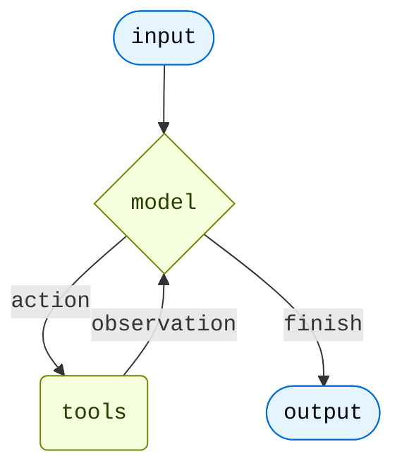

import AgentInvocationThreadAndContextJs from '/snippets/code-samples/agent-invocation-thread-and-context-js.mdx';
import AgentInvocationThreadAndContextPy from '/snippets/code-samples/agent-invocation-thread-and-context-py.mdx';
import AgentInvocationThreadIdJs from '/snippets/code-samples/agent-invocation-thread-id-js.mdx';
import AgentInvocationThreadIdPy from '/snippets/code-samples/agent-invocation-thread-id-py.mdx';

An agent is a model calling tools in a loop until the task is complete.



<Note>
**agent = model + harness**

The job of a harness: get the model the right context at the right time for the given task.
</Note>

A harness is everything around that loop: the model, its prompt, its tools, and any middleware that shapes its behavior.

@[`create_agent`] is a configurable harness. At its simplest:

:::python
```python
from langchain.agents import create_agent

agent = create_agent("openai:gpt-5.4", tools=tools)
```
:::
:::js
```typescript
import { createAgent } from "langchain";

const agent = createAgent({ model: "openai:gpt-5.4", tools });
```
:::

You extend it through two levers:

- **Arguments**: `tools=`, `system_prompt=`, and `response_format=` wire in capabilities directly.
- **Middleware**: each middleware bundles prompts, tools, and loop logic into a composable unit. Pass one or more to `middleware=` to extend the harness.

## Core components

### Model

Pass a model identifier string (`"provider:model"`) or an initialized model instance. See [Models](/oss/langchain/models) for parameters, provider setup, and dynamic model selection.

:::python
```python
from langchain.agents import create_agent

agent = create_agent("openai:gpt-5.4", tools=tools)
```
:::
:::js
```typescript
import { createAgent } from "langchain";

const agent = createAgent({ model: "openai:gpt-5.4", tools });
```
:::

### Tools

Pass any Python callable, LangChain tool, or tool dict. See [Tools](/oss/langchain/tools) for tool definition, context access, and dynamic tool selection.

:::python
```python
from langchain.tools import tool

@tool
def search(query: str) -> str:
    """Search for information."""
    return f"Results for: {query}"

agent = create_agent("openai:gpt-5.4", tools=[search])
```
:::
:::js
```typescript
import { createAgent, tool } from "langchain";
import * as z from "zod";

const search = tool(({ query }) => `Results for: ${query}`, {
  name: "search",
  description: "Search for information",
  schema: z.object({ query: z.string() }),
});

const agent = createAgent({ model: "openai:gpt-5.4", tools: [search] });
```
:::

### System prompt

Shape how the agent approaches tasks. Accepts a string or `SystemMessage`. For dynamic prompts at runtime, use [middleware](/oss/langchain/middleware).

:::python
```python
agent = create_agent(
    "openai:gpt-5.4",
    tools=tools,
    system_prompt="You are a helpful assistant. Be concise and accurate.",
)
```
:::
:::js
```typescript
const agent = createAgent({
  model: "openai:gpt-5.4",
  tools,
  systemPrompt: "You are a helpful assistant. Be concise and accurate.",
});
```
:::

### Structured output

Return a validated schema from the agent using `response_format=`. See [Structured output](/oss/langchain/structured-output) for strategies and examples.

:::python
```python
from pydantic import BaseModel
from langchain.agents import create_agent

class Answer(BaseModel):
    summary: str
    confidence: float

agent = create_agent("openai:gpt-5.4", tools=tools, response_format=Answer)
result = agent.invoke({"messages": [{"role": "user", "content": "Summarize AI trends"}]})
result["structured_response"]  # Answer(summary=..., confidence=...)
```
:::
:::js
```typescript
import * as z from "zod";

const Answer = z.object({ summary: z.string(), confidence: z.number() });

const agent = createAgent({ model: "openai:gpt-5.4", tools, responseFormat: Answer });
const result = await agent.invoke({ messages: [{ role: "user", content: "Summarize AI trends" }] });
result.structuredResponse; // { summary: ..., confidence: ... }
```
:::

### Name

Optional identifier used as the node name when embedding this agent as a subgraph in [multi-agent](/oss/langchain/multi-agent) systems.

:::python
```python
agent = create_agent("openai:gpt-5.4", tools=tools, name="research_assistant")
```
:::
:::js
```typescript
const agent = createAgent({ model: "openai:gpt-5.4", tools, name: "research_assistant" });
```
:::


<Tip>
To extend the agent's state schema with custom fields, use [`state_schema`](/oss/langchain/long-term-memory) on `create_agent` or define it via middleware. See [Memory](/oss/langchain/long-term-memory) for details.
</Tip>
## Invocation

<Tip>
Trace each step of this loop, debug tool calls, and evaluate agent outputs with [LangSmith](https://smith.langchain.com). Follow the [tracing quickstart](/langsmith/trace-with-langchain) to get set up.
</Tip>


:::python
You can invoke an agent by passing an update to its [`State`](/oss/langgraph/graph-api#state). All agents include a [sequence of messages](/oss/langgraph/use-graph-api#messagesstate) in their state; to invoke the agent, pass a new message along with a `thread_id` so the agent can persist and resume conversation history:
:::
:::js
You can invoke an agent by passing an update to its [`State`](/oss/langgraph/graph-api#state). All agents include a [sequence of messages](/oss/langgraph/use-graph-api#messagesvalue) in their state; to invoke the agent, pass a new message along with a `thread_id` so the agent can persist and resume conversation history:
:::

:::python

<AgentInvocationThreadIdPy />

:::
:::js

<AgentInvocationThreadIdJs />

:::

<Note>
Persisting conversation history with `thread_id` requires the agent to be configured with a [checkpointer](/oss/langchain/long-term-memory). When deployed on [LangSmith](/langsmith/deployment), a checkpointer is provisioned automatically. Locally, pass one explicitly, for example `create_agent(..., checkpointer=InMemorySaver())`.
</Note>

:::python
If you also need to pass per-run configuration (such as a user ID, API keys, or feature flags) to tools and middleware, pass it as `context` alongside `config`. Define the shape of that data with `context_schema` and access it through `runtime.context`:

<AgentInvocationThreadAndContextPy />

`thread_id` scopes the *conversation* (message history, checkpoints), while `context` carries *per-run* data your tools and middleware read at invocation time. Both are commonly passed together. See [tool context](/oss/langchain/tools#context) and [Runtime](/oss/langchain/runtime) for more.
:::
:::js
If you also need to pass per-run configuration (such as a user ID, API keys, or feature flags) to tools and middleware, pass it as `context` alongside the config. Define the shape of that data with `contextSchema` and access it through `runtime.context`:

<AgentInvocationThreadAndContextJs />

`thread_id` scopes the *conversation* (message history, checkpoints), while `context` carries *per-run* data your tools and middleware read at invocation time. Both are commonly passed together. See [tool context](/oss/langchain/tools#context) and [Runtime](/oss/langchain/runtime) for more.
:::

### Streaming

We've seen how the agent can be called with `invoke` to get a final response. If the agent executes multiple steps, this may take a while. To show intermediate progress, we can stream back messages as they occur.

:::python
```python
from langchain.messages import AIMessage, HumanMessage

for chunk in agent.stream({
    "messages": [{"role": "user", "content": "Search for AI news and summarize the findings"}]
}, stream_mode="values"):
    # Each chunk contains the full state at that point
    latest_message = chunk["messages"][-1]
    if latest_message.content:
        if isinstance(latest_message, HumanMessage):
            print(f"User: {latest_message.content}")
        elif isinstance(latest_message, AIMessage):
            print(f"Agent: {latest_message.content}")
    elif latest_message.tool_calls:
        print(f"Calling tools: {[tc['name'] for tc in latest_message.tool_calls]}")
```
:::
:::js
```ts
const stream = await agent.stream(
  {
    messages: [{
      role: "user",
      content: "Search for AI news and summarize the findings"
    }],
  },
  { streamMode: "values" }
);

for await (const chunk of stream) {
  // Each chunk contains the full state at that point
  const latestMessage = chunk.messages.at(-1);
  if (latestMessage?.content) {
    console.log(`Agent: ${latestMessage.content}`);
  } else if (latestMessage?.tool_calls) {
    const toolCallNames = latestMessage.tool_calls.map((tc) => tc.name);
    console.log(`Calling tools: ${toolCallNames.join(", ")}`);
  }
}
```
:::

<Tip>
For more details on streaming, see [Streaming](/oss/langchain/streaming).
</Tip>

## Configure the harness

Middleware extends the harness by adding capabilities across six categories. Each middleware bundles its own prompts, tools, and loop logic. Pick what your use case needs.

<CardGroup cols={2}>
  <Card title="Execution environment" icon="bolt" href="#execution-environment">
    Tools, filesystem, sandboxes, and code execution
  </Card>
  <Card title="Context management" icon="database" href="#context-management">
    Summarization, memory, skills, and prompt caching
  </Card>
  <Card title="Planning and delegation" icon="sitemap" href="#planning-and-delegation">
    Todo lists and subagents for parallel, isolated work
  </Card>
  <Card title="Fault tolerance" icon="shield" href="#fault-tolerance">
    Retries, fallbacks, and call limits
  </Card>
  <Card title="Guardrails" icon="lock" href="#guardrails">
    PII detection and content controls
  </Card>
  <Card title="Steering" icon="user" href="#steering">
    Human-in-the-loop approval before high-impact actions
  </Card>
</CardGroup>

### Execution environment

The execution environment is where the agent takes action. Tools give the model a set of callable actions: any function, API, or database query. The filesystem extends those actions across turns, letting the agent read, write, and organize files as it works. Sandboxes and interpreters add code execution: sandboxes for isolated shell access, a QuickJS interpreter for lightweight in-process scripting.

| Capability | How to add | In `create_deep_agent` |
|---|---|---|
| **Tools**: functions, APIs, databases | `tools=` on `create_agent` | ✓ via `tools=` |
| **Virtual filesystem**: files persisted across turns | @[`FilesystemMiddleware`] | ✓ |
| **REPL**: in-process scripting (QuickJS) | [`CodeInterpreterMiddleware`](/oss/deepagents/interpreters) | — |
| **Shell**: shared working directory across turns | @[`ShellToolMiddleware`] | — |
| **Sandbox**: code execution isolated from the host | [`SandboxBackend`](/oss/deepagents/sandboxes) | — |

:::python

```python
from langchain.agents import create_agent
from deepagents.backends import StateBackend
from deepagents.middleware import FilesystemMiddleware

agent = create_agent(
    model="anthropic:claude-sonnet-4-6",
    tools=[search, fetch_url],
    middleware=[  # add what your use case needs
        FilesystemMiddleware(backend=StateBackend()),
    ],
)
```

:::

:::js

```typescript
import { createAgent } from "langchain";
import { FilesystemMiddleware, StateBackend } from "deepagents";

const agent = createAgent({
  model: "anthropic:claude-sonnet-4-6",
  tools: [search, fetchUrl],
  middleware: [  // add what your use case needs
    new FilesystemMiddleware({ backend: new StateBackend() }),
  ],
});
```

:::

### Context management

Context management has three jobs: optimize what's in the context window at any given turn, prevent overflow and context rot as the run grows, and improve what the agent knows across sessions.

| Capability | How to add | In `create_deep_agent` |
|---|---|---|
| **Summarization**: compresses history and offloads large results | @[`SummarizationMiddleware`] | ✓ |
| **Summarization tool**: agent controls when to compress | @[`SummarizationToolMiddleware`] | — |
| **Memory**: AGENTS.md instructions loaded at startup | @[`MemoryMiddleware`] | ✓ if `memory=` |
| **Skills**: domain knowledge loaded progressively | @[`SkillsMiddleware`] | ✓ if `skills=` |
| **Prompt caching**: reuses static prompt sections (Anthropic) | @[`AnthropicPromptCachingMiddleware`] | ✓ Anthropic |
| **Dynamic tools**: trims tool list per model call | @[`LLMToolSelectorMiddleware`] | — |

:::python

```python
from langchain.agents import create_agent
from deepagents.backends import StateBackend
from deepagents.middleware import (
    FilesystemMiddleware,
    MemoryMiddleware,
    SkillsMiddleware,
    SummarizationMiddleware,
)

backend = StateBackend()
model = "anthropic:claude-sonnet-4-6"

agent = create_agent(
    model=model,
    tools=[search],
    middleware=[  # add what your use case needs
        FilesystemMiddleware(backend=backend),
        SummarizationMiddleware(model=model, backend=backend),
        MemoryMiddleware(backend=backend, sources=["./AGENTS.md"]),
        SkillsMiddleware(backend=backend, sources=["./skills/"]),
    ],
)
```

:::

:::js

```typescript
import { createAgent } from "langchain";
import {
  FilesystemMiddleware,
  MemoryMiddleware,
  SkillsMiddleware,
  SummarizationMiddleware,
  StateBackend,
} from "deepagents";

const backend = new StateBackend();
const model = "anthropic:claude-sonnet-4-6";

const agent = createAgent({
  model,
  tools: [search],
  middleware: [  // add what your use case needs
    new FilesystemMiddleware({ backend }),
    new SummarizationMiddleware({ model, backend }),
    new MemoryMiddleware({ backend, sources: ["./AGENTS.md"] }),
    new SkillsMiddleware({ backend, sources: ["./skills/"] }),
  ],
});
```

:::

### Planning and delegation

Some tasks are too large or too parallel for a single context window. Delegation lets the main agent hand off focused subtasks to subagents. Each runs independently in its own context window and returns a single result, keeping the main agent's context clean and enabling parallel execution.

| Capability | How to add | In `create_deep_agent` |
|---|---|---|
| **Todo list**: structured task tracking across turns | @[`TodoListMiddleware`] | ✓ |
| **Subagents**: isolated subtasks in their own context windows | @[`SubAgentMiddleware`] | ✓ |
| **Async subagents**: fire-and-forget tasks the main agent doesn't wait on | @[`AsyncSubAgentMiddleware`] | — |

:::python

```python
from langchain.agents import create_agent
from langchain.agents.middleware import TodoListMiddleware
from deepagents import SubAgent
from deepagents.backends import StateBackend
from deepagents.middleware import (
    FilesystemMiddleware,
    MemoryMiddleware,
    SkillsMiddleware,
    SubAgentMiddleware,
    SummarizationMiddleware,
)

backend = StateBackend()
model = "anthropic:claude-sonnet-4-6"

researcher: SubAgent = {
    "name": "researcher",
    "description": "Deep-dives into a topic and returns a structured summary.",
    "system_prompt": "You are a research specialist. Search thoroughly and cite your sources.",
    "tools": [search],
}

agent = create_agent(
    model=model,
    tools=[search],
    middleware=[
        FilesystemMiddleware(backend=backend),
        SummarizationMiddleware(model=model, backend=backend),
        MemoryMiddleware(backend=backend, sources=["./AGENTS.md"]),
        SkillsMiddleware(backend=backend, sources=["./skills/"]),
        TodoListMiddleware(),
        SubAgentMiddleware(backend=backend, subagents=[researcher]),
    ],
)
```

:::

:::js

```typescript
import { createAgent, TodoListMiddleware } from "langchain";
import {
  FilesystemMiddleware,
  MemoryMiddleware,
  SkillsMiddleware,
  SubAgentMiddleware,
  SummarizationMiddleware,
  StateBackend,
} from "deepagents";

const backend = new StateBackend();
const model = "anthropic:claude-sonnet-4-6";

const researcher = {
  name: "researcher",
  description: "Deep-dives into a topic and returns a structured summary.",
  systemPrompt: "You are a research specialist. Search thoroughly and cite your sources.",
  tools: [search],
};

const agent = createAgent({
  model,
  tools: [search],
  middleware: [
    new FilesystemMiddleware({ backend }),
    new SummarizationMiddleware({ model, backend }),
    new MemoryMiddleware({ backend, sources: ["./AGENTS.md"] }),
    new SkillsMiddleware({ backend, sources: ["./skills/"] }),
    new TodoListMiddleware(),
    new SubAgentMiddleware({ backend, subagents: [researcher] }),
  ],
});
```

:::

### Fault tolerance

Production agents encounter failures that dev environments don't: rate limits, model timeouts, transient tool errors. These middleware handle failure at the infrastructure level so your tools and business logic stay clean.

| Capability | How to add | In `create_deep_agent` |
|---|---|---|
| **Model retry**: retries on transient model failures | @[`ModelRetryMiddleware`] | — |
| **Tool retry**: retries on rate limits or transient tool errors | @[`ToolRetryMiddleware`] | — |
| **Model fallback**: switches to an alternate model on failure | @[`ModelFallbackMiddleware`] | — |
| **Model call cap**: bounds total model calls per session | @[`ModelCallLimitMiddleware`] | — |
| **Tool call cap**: bounds total tool calls per session | @[`ToolCallLimitMiddleware`] | — |

:::python

```python
from langchain.agents import create_agent
from langchain.agents.middleware import ModelRetryMiddleware, ToolRetryMiddleware

agent = create_agent(
    model="anthropic:claude-sonnet-4-6",
    tools=[search],
    middleware=[
        ModelRetryMiddleware(max_retries=3),
        ToolRetryMiddleware(max_retries=2),
    ],
)
```

:::

:::js

```typescript
import { createAgent, ModelRetryMiddleware, ToolRetryMiddleware } from "langchain";

const agent = createAgent({
  model: "anthropic:claude-sonnet-4-6",
  tools: [search],
  middleware: [
    new ModelRetryMiddleware({ maxRetries: 3 }),
    new ToolRetryMiddleware({ maxRetries: 2 }),
  ],
});
```

:::

### Guardrails

Guardrails intercept data as it flows through the agent loop, enforcing compliance or content policies before tool results reach the model's context.

| Capability | How to add | In `create_deep_agent` |
|---|---|---|
| **PII detection**: redacts personal data from tool results before they enter the context | @[`PIIMiddleware`] | — |

### Steering

Fully autonomous agents aren't always the right call. Steering lets you pause execution before specific tool calls (destructive writes, expensive API calls, anything requiring human judgment) so a human can approve, edit, or reject before the agent proceeds.

| Capability | How to add | In `create_deep_agent` |
|---|---|---|
| **Human-in-the-loop**: pause for approval before specified tool calls | @[`HumanInTheLoopMiddleware`] | ✓ if `interrupt_on=` |

:::python

```python
from langchain.agents import create_agent
from langchain.agents.middleware import HumanInTheLoopMiddleware, TodoListMiddleware
from deepagents import SubAgent
from deepagents.backends import StateBackend
from deepagents.middleware import (
    FilesystemMiddleware,
    MemoryMiddleware,
    SkillsMiddleware,
    SubAgentMiddleware,
    SummarizationMiddleware,
)

backend = StateBackend()
model = "anthropic:claude-sonnet-4-6"

researcher: SubAgent = {
    "name": "researcher",
    "description": "Deep-dives into a topic and returns a structured summary.",
    "system_prompt": "You are a research specialist. Search thoroughly and cite your sources.",
    "tools": [search],
}

agent = create_agent(
    model=model,
    tools=[search],
    middleware=[
        FilesystemMiddleware(backend=backend),
        SummarizationMiddleware(model=model, backend=backend),
        MemoryMiddleware(backend=backend, sources=["./AGENTS.md"]),
        SkillsMiddleware(backend=backend, sources=["./skills/"]),
        TodoListMiddleware(),
        SubAgentMiddleware(backend=backend, subagents=[researcher]),
        HumanInTheLoopMiddleware(interrupt_on={"write_file": True}),
    ],
)
```

:::

:::js

```typescript
import { createAgent, HumanInTheLoopMiddleware, TodoListMiddleware } from "langchain";
import {
  FilesystemMiddleware,
  MemoryMiddleware,
  SkillsMiddleware,
  SubAgentMiddleware,
  SummarizationMiddleware,
  StateBackend,
} from "deepagents";

const backend = new StateBackend();
const model = "anthropic:claude-sonnet-4-6";

const researcher = {
  name: "researcher",
  description: "Deep-dives into a topic and returns a structured summary.",
  systemPrompt: "You are a research specialist. Search thoroughly and cite your sources.",
  tools: [search],
};

const agent = createAgent({
  model,
  tools: [search],
  middleware: [
    new FilesystemMiddleware({ backend }),
    new SummarizationMiddleware({ model, backend }),
    new MemoryMiddleware({ backend, sources: ["./AGENTS.md"] }),
    new SkillsMiddleware({ backend, sources: ["./skills/"] }),
    new TodoListMiddleware(),
    new SubAgentMiddleware({ backend, subagents: [researcher] }),
    new HumanInTheLoopMiddleware({ interruptOn: { writeFile: true } }),
  ],
});
```

:::

<Tip>
`create_deep_agent` pre-assembles this stack for long-running coding and research tasks (filesystem, summarization, subagents, and prompt caching included by default). See [Deep Agents](/oss/deepagents/harness) for the full pre-built harness.
</Tip>

**Middleware resources:**
- [Middleware overview](/oss/langchain/middleware/overview): how the middleware stack works and when hooks fire
- [Prebuilt middleware](/oss/langchain/middleware/built-in): full reference with configuration examples
- [Custom middleware](/oss/langchain/middleware/custom): write your own hooks for business logic, PII scrubbing, and more
