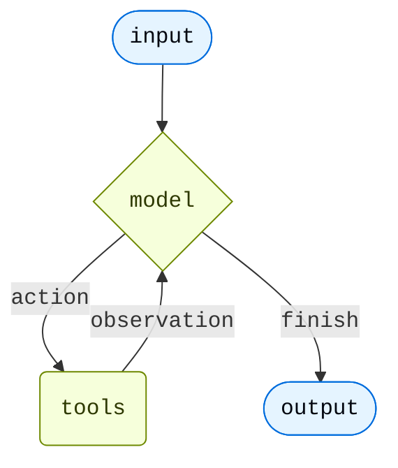

<Note>
**agent = model + harness**

The job of a harness: get the model the right context at the right time for the given task.
</Note>

At its core, an agent is a model calling tools in a loop until the task is complete.



The harness is everything wrapped around that loop. For a simple task the harness is trivial. But agents that do real work need more.

<CardGroup cols={2}>
  <Card title="Act in an environment" icon="bolt">
    Take actions via tools, read and write files, execute code
  </Card>
  <Card title="Connect to your data" icon="database">
    Load memories, skills, and domain knowledge at the right moment
  </Card>
  <Card title="Manage growing context" icon="scissors">
    Summarize history and offload large results across long runs
  </Card>
  <Card title="Parallelize tasks" icon="sitemap">
    Delegate to specialized subagents running in isolated context windows
  </Card>
  <Card title="Stay in the loop" icon="user">
    Pause for human approval at critical decision points
  </Card>
  <Card title="Improve over time" icon="rocket">
    Update memory, skills, and prompts based on real usage
  </Card>
</CardGroup>

[`create_agent`][langchain.agents.create_agent] is the minimal harness—a model calling tools in a loop. You extend it by adding [middleware](/oss/langchain/middleware/overview): each middleware hooks into one stage of the loop and adds one capability without changing the harness itself.

Not every agent needs every capability. Design the harness around what your application does. A research agent needs search tools, a filesystem to persist findings, and summarization to stay coherent across long runs. A coding agent needs filesystem access, a sandbox for safe execution, and human-in-the-loop for risky writes. A customer support agent needs memory for user preferences and HITL for escalations. Start with what your use case requires—add the rest as your agent's scope grows.

---

## Execution environment

The execution environment is the complete space where an agent acts: the tools it can call, the filesystem where it reads and writes files, and the sandbox or interpreter where it runs code. These are not separate add-ons—they are one unified capability for taking action in the world.

| Capability | How to add |
|---|---|
| Custom tools (functions, APIs, databases) | `tools=` on `create_agent` |
| Virtual filesystem + file tools | @[`FilesystemMiddleware`] |
| JavaScript REPL (QuickJS) | [`CodeInterpreterMiddleware`](/oss/deepagents/interpreters) (`langchain_quickjs`) |
| Persistent shell across turns | @[`ShellToolMiddleware`] |
| Isolated sandbox with shell execution | [`SandboxBackend`](/oss/deepagents/sandboxes) |

:::python

```python
from langchain.agents import create_agent
from deepagents.backends import StateBackend
from deepagents.middleware import FilesystemMiddleware

agent = create_agent(
    model="anthropic:claude-sonnet-4-6",
    tools=[search, fetch_url],
    middleware=[
        FilesystemMiddleware(backend=StateBackend()),
    ],
)
```

:::


---

## Context management

Context management controls what the agent knows and how long it can run. Summarization keeps history lean; memory injects persistent instructions; skills load domain knowledge on demand.

| Capability | How to add |
|---|---|
| History compression + large-result offloading | @[`SummarizationMiddleware`] |
| Agent-triggered summarization | @[`SummarizationToolMiddleware`] |
| Persistent instructions via `AGENTS.md` | @[`MemoryMiddleware`] |
| On-demand domain knowledge | @[`SkillsMiddleware`] |
| Prompt caching (Anthropic) | @[`AnthropicPromptCachingMiddleware`] |
| Dynamic tool filtering | @[`LLMToolSelectorMiddleware`] |

:::python

```python
from langchain.agents import create_agent
from deepagents.backends import StateBackend
from deepagents.middleware import (
    FilesystemMiddleware,
    MemoryMiddleware,
    SkillsMiddleware,
    SummarizationMiddleware,
)

backend = StateBackend()
model = "anthropic:claude-sonnet-4-6"

agent = create_agent(
    model=model,
    tools=[search],
    middleware=[
        FilesystemMiddleware(backend=backend),
        SummarizationMiddleware(model=model, backend=backend),  # compresses at ~85% context fill
        MemoryMiddleware(backend=backend, sources=["./AGENTS.md"]),
        SkillsMiddleware(backend=backend, sources=["./skills/"]),
    ],
)
```

:::

---

## Planning and delegation

Delegation breaks large problems into parallel or sequential units of work. Each subagent runs in its own context window—delegating keeps the main agent's context clean and allows work to run in parallel.

| Capability | How to add |
|---|---|
| Todo list tracking across turns | @[`TodoListMiddleware`] |
| Sync subagent spawning | @[`SubAgentMiddleware`] |
| Background non-blocking subagents | @[`AsyncSubAgentMiddleware`] |

:::python

```python
from langchain.agents import create_agent
from langchain.agents.middleware import TodoListMiddleware
from deepagents import SubAgent
from deepagents.backends import StateBackend
from deepagents.middleware import (
    FilesystemMiddleware,
    MemoryMiddleware,
    SkillsMiddleware,
    SubAgentMiddleware,
    SummarizationMiddleware,
)

backend = StateBackend()
model = "anthropic:claude-sonnet-4-6"

researcher: SubAgent = {
    "name": "researcher",
    "description": "Deep-dives into a topic and returns a structured summary.",
    "system_prompt": "You are a research specialist. Search thoroughly and cite your sources.",
    "tools": [search],
}

agent = create_agent(
    model=model,
    tools=[search],
    middleware=[
        FilesystemMiddleware(backend=backend),
        SummarizationMiddleware(model=model, backend=backend),
        MemoryMiddleware(backend=backend, sources=["./AGENTS.md"]),
        SkillsMiddleware(backend=backend, sources=["./skills/"]),
        TodoListMiddleware(),
        SubAgentMiddleware(backend=backend, subagents=[researcher]),
    ],
)
```

:::

---

## Fault tolerance

| Capability | How to add |
|---|---|
| Retry on model call failure | @[`ModelRetryMiddleware`] |
| Retry failed tool calls | @[`ToolRetryMiddleware`] |
| Fall back to an alternate model | @[`ModelFallbackMiddleware`] |
| Cap total model calls per session | @[`ModelCallLimitMiddleware`] |
| Cap total tool calls per session | @[`ToolCallLimitMiddleware`] |

:::python

```python
from langchain.agents import create_agent
from langchain.agents.middleware import ModelRetryMiddleware, ToolRetryMiddleware

agent = create_agent(
    model="anthropic:claude-sonnet-4-6",
    tools=[search],
    middleware=[
        ModelRetryMiddleware(max_retries=3),
        ToolRetryMiddleware(max_retries=2),
    ],
)
```

:::

---

## Guardrails

| Capability | How to add |
|---|---|
| Detect and redact PII from tool results | @[`PIIMiddleware`] |

---

## Steering

Pause before high-impact actions so a human can approve, edit, or reject. Requires a checkpointer to persist state while waiting.

| Capability | How to add |
|---|---|
| Pause for human approval before tool calls | @[`HumanInTheLoopMiddleware`] |

:::python

```python
from langchain.agents import create_agent
from langchain.agents.middleware import HumanInTheLoopMiddleware, TodoListMiddleware
from langgraph.checkpoint.memory import MemorySaver
from deepagents import SubAgent
from deepagents.backends import StateBackend
from deepagents.middleware import (
    FilesystemMiddleware,
    MemoryMiddleware,
    SkillsMiddleware,
    SubAgentMiddleware,
    SummarizationMiddleware,
)

backend = StateBackend()
model = "anthropic:claude-sonnet-4-6"

researcher: SubAgent = {
    "name": "researcher",
    "description": "Deep-dives into a topic and returns a structured summary.",
    "system_prompt": "You are a research specialist. Search thoroughly and cite your sources.",
    "tools": [search],
}

agent = create_agent(
    model=model,
    tools=[search],
    middleware=[
        FilesystemMiddleware(backend=backend),                               # execution environment
        SummarizationMiddleware(model=model, backend=backend),               # context management
        MemoryMiddleware(backend=backend, sources=["./AGENTS.md"]),          # context management
        SkillsMiddleware(backend=backend, sources=["./skills/"]),            # context management
        TodoListMiddleware(),                                                 # delegation
        SubAgentMiddleware(backend=backend, subagents=[researcher]),         # delegation
        HumanInTheLoopMiddleware(interrupt_on={"write_file": True}),        # steering
    ],
    checkpointer=MemorySaver(),
)
```

:::

---

<Tip>
`create_deep_agent` pre-assembles this stack for long-running coding and research tasks—filesystem, summarization, subagents, and prompt caching included by default. See [Deep Agents](/oss/deepagents/harness) for the full pre-built harness.
</Tip>

**Middleware resources:**
- [Middleware overview](/oss/langchain/middleware/overview)—how the middleware stack works and when hooks fire
- [Prebuilt middleware](/oss/langchain/middleware/built-in)—full reference with configuration examples
- [Custom middleware](/oss/langchain/middleware/custom)—write your own hooks for business logic, PII scrubbing, and more
