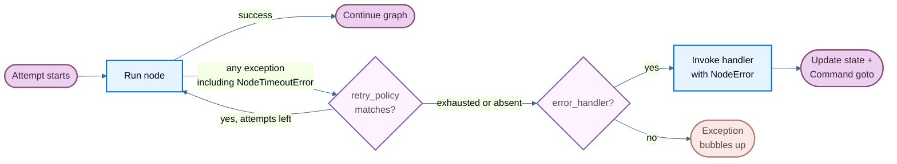

When a node fails—from a slow external API, a transient network error, or an unhandled exception—LangGraph gives you three composable mechanisms to respond:

- [**Retries**](#retries) — automatically re-run failed attempts based on exception type and backoff settings
- [**Timeouts**](#timeouts) — cap how long a single attempt may run
- [**Error handling**](#error-handling) — run a recovery function after all retries are exhausted

:::python
Use [**`set_node_defaults`**](#graph-defaults) to configure these mechanisms once for all nodes instead of repeating them on every `add_node` call.
:::

:::js
Use [**`setNodeDefaults`**](#graph-defaults) to configure these mechanisms once for all nodes instead of repeating them on every `addNode` call.
:::

These compose in a fixed order: when a node attempt raises any exception (including @[`NodeTimeoutError`] from a timeout), the retry policy decides whether to retry. Only after retries are exhausted does the error handler run.

For stopping a run cleanly at a superstep boundary and resuming later, see [Graceful shutdown](#graceful-shutdown).

:::python
<Note>
Per-node timeouts and node-level error handlers require `langgraph>=1.2`.
</Note>
:::

:::js
<Note>
Per-node timeouts and node-level error handlers require `@langchain/langgraph>=1.4.0`.
</Note>
:::



## Retries

A retry policy automatically re-runs a failed node attempt based on exception type and backoff settings.

:::python
Pass `retry_policy=` to @[`add_node`]:

```python
from langgraph.types import RetryPolicy

builder.add_node(
    "call_api",
    call_api,
    retry_policy=RetryPolicy(max_attempts=3),
)
```
:::

:::js
Pass `retryPolicy` to @[`addNode`]:

```typescript
import { StateGraph } from "@langchain/langgraph";

const graph = new StateGraph(State)
  .addNode("callApi", callApi, { retryPolicy: { maxAttempts: 3 } })
  .compile();
```
:::

### Default behavior

:::python
By default, `retry_on` uses `default_retry_on`, which retries on **any** exception except the following (and their subclasses):

- `ValueError`
- `TypeError`
- `ArithmeticError`
- `ImportError`
- `LookupError`
- `NameError`
- `SyntaxError`
- `RuntimeError`
- `ReferenceError`
- `StopIteration`
- `StopAsyncIteration`
- `OSError`

For exceptions from popular HTTP libraries such as `requests` and `httpx`, it only retries on 5xx status codes. @[`NodeTimeoutError`] is retryable by default.
:::

:::js
Retries are opt-in. A node retries only when it has a `retryPolicy` configured, either directly or through graph defaults with [`setNodeDefaults`](#graph-defaults). An empty policy (`{}`) is enough. Without a policy, the first failure ends the attempt and LangGraph does not call `retryOn`.

If the policy omits `retryOn`, LangGraph uses a built-in handler that retries thrown errors except:

- Abort and cancellation errors: `error.name === "AbortError"`, or `error.message` starts with `"Cancel"` or `"AbortError"`
- `GraphValueError`, matched by `error.name`
- Aborted connections: `error.code === "ECONNABORTED"`
- HTTP client errors with status 400, 401, 402, 403, 404, 405, 406, 407, or 409, read from `error.response?.status` or `error.status` for clients such as `fetch`, Axios, and similar clients
- OpenAI-style quota errors: `error.error?.code === "insufficient_quota"`

Other HTTP statuses, including 408 and 5xx responses, are retryable unless you override `retryOn`. @[`NodeTimeoutError`] is not on this blocklist, so it is retryable when a retry policy is configured.

Some failures bypass `retryOn`. Graph control-flow errors, such as `GraphInterrupt` and `Command` routing, bubble up without retrying. An aborted run signal also stops the retry loop, even if `retryOn` would return `true`.
:::

### Parameters

:::python
| Parameter | Type | Default | Description |
| --------- | ---- | ------- | ----------- |
| `max_attempts` | `int` | `3` | Maximum number of attempts, including the first. |
| `initial_interval` | `float` | `0.5` | Seconds before the first retry. |
| `backoff_factor` | `float` | `2.0` | Multiplier applied to the interval after each retry. |
| `max_interval` | `float` | `128.0` | Maximum seconds between retries. |
| `jitter` | `bool` | `True` | Add random jitter to the interval. |
| `retry_on` | `type[Exception] \| Sequence[type[Exception]] \| Callable[[Exception], bool]` | `default_retry_on` | Exceptions to retry on, or a callable returning `True` for retryable exceptions. |
:::

:::js
| Parameter | Type | Default | Description |
| --------- | ---- | ------- | ----------- |
| `maxAttempts` | `number` | `3` | Maximum number of attempts, including the first. |
| `initialInterval` | `number` | `500` | Milliseconds before the first retry. |
| `backoffFactor` | `number` | `2.0` | Multiplier applied to the interval after each retry. |
| `maxInterval` | `number` | `128000` | Maximum milliseconds between retries. |
| `jitter` | `boolean` | `true` | Add random jitter to the interval. |
| `retryOn` | `(error: unknown) => boolean` | built-in handler (when policy is set) | Callable returning `true` for retryable exceptions. Only used when `retryPolicy` is configured. |
| `logWarning` | `boolean` | `true` | Whether to log a warning when a retry is attempted. |
:::

### Custom retry logic

:::python
Pass a callable or exception type to `retry_on`. Import `default_retry_on` to extend the default behavior:

```python
from langgraph.types import RetryPolicy, default_retry_on

def custom_retry_on(exc: BaseException) -> bool:
    if isinstance(exc, MyCustomError):
        return False
    return default_retry_on(exc)

builder.add_node(
    "call_api",
    call_api,
    retry_policy=RetryPolicy(max_attempts=3, retry_on=custom_retry_on),
)
```
:::

:::js
Pass a callable to `retryOn`. Unlike Python, there is no exported `defaultRetryOn` helper—implement your own predicate:

```typescript
import { StateGraph } from "@langchain/langgraph";

class MyCustomError extends Error {}

const graph = new StateGraph(State)
  .addNode("callApi", callApi, {
    retryPolicy: {
      maxAttempts: 3,
      retryOn: (error: unknown) => {
        if (error instanceof MyCustomError) return false;
        // Retry on other errors
        return true;
      },
    },
  })
  .compile();
```
:::

### Inspect retry state

Use execution info inside a node to inspect the current attempt number. This is useful for switching to a fallback when the primary call keeps failing:

:::python
```python
from langgraph.graph import StateGraph, START, END
from langgraph.runtime import Runtime
from langgraph.types import RetryPolicy
from typing_extensions import TypedDict

class State(TypedDict):
    result: str

def my_node(state: State, runtime: Runtime) -> State:
    if runtime.execution_info.node_attempt > 1:  # [!code highlight]
        return {"result": call_fallback_api()}
    return {"result": call_primary_api()}

builder = StateGraph(State)
builder.add_node("my_node", my_node, retry_policy=RetryPolicy(max_attempts=3))
builder.add_edge(START, "my_node")
builder.add_edge("my_node", END)
```

`execution_info` exposes the following fields:

| Attribute | Type | Description |
| --------- | ---- | ----------- |
| `node_attempt` | `int` | Current attempt number (1-indexed). `1` on the first try, `2` on the first retry, etc. |
| `node_first_attempt_time` | `float \| None` | Unix timestamp of when the first attempt started. Constant across retries. |
| `thread_id` | `str \| None` | Thread ID for the current execution. `None` without a checkpointer. |
| `run_id` | `str \| None` | Run ID for the current execution. `None` when not provided in config. |
| `checkpoint_id` | `str` | Checkpoint ID for the current execution. |
| `task_id` | `str` | Task ID for the current execution. |

`execution_info` is available even without a retry policy—`node_attempt` defaults to `1`.
:::

:::js
```typescript
import { StateGraph, StateSchema, START, END, type Runtime } from "@langchain/langgraph";
import * as z from "zod";

const State = new StateSchema({
  result: z.string(),
});

const myNode = async (state: typeof State.State, runtime: Runtime<typeof State>) => {
  if ((runtime.executionInfo?.nodeAttempt ?? 1) > 1) {  // [!code highlight]
    return { result: await callFallbackApi() };
  }
  return { result: await callPrimaryApi() };
};

const graph = new StateGraph(State)
  .addNode("myNode", myNode, { retryPolicy: { maxAttempts: 3 } })
  .addEdge(START, "myNode")
  .addEdge("myNode", END)
  .compile();
```

`executionInfo` exposes the following fields:

| Attribute | Type | Description |
| --------- | ---- | ----------- |
| `nodeAttempt` | `number` | Current attempt number (1-indexed). `1` on the first try, `2` on the first retry, etc. |
| `nodeFirstAttemptTime` | `number \| undefined` | Unix timestamp (ms) of when the first attempt started. Constant across retries. |
| `threadId` | `string \| undefined` | Thread ID for the current execution. `undefined` without a checkpointer. |
| `runId` | `string \| undefined` | Run ID for the current execution. `undefined` when not provided in config. |
| `checkpointId` | `string` | Checkpoint ID for the current execution. |
| `checkpointNs` | `string` | Checkpoint namespace for the current execution. |
| `taskId` | `string` | Task ID for the current execution. |

`executionInfo` is available even without a retry policy—`nodeAttempt` defaults to `1`.
:::

## Timeouts

:::python
<Note>
Requires `langgraph>=1.2`.
</Note>

The `timeout=` parameter on @[`add_node`] caps how long a single node attempt may run. Pass a number (seconds), a `timedelta`, or a @[`TimeoutPolicy`] for separate run and idle limits:

```python
from datetime import timedelta
from langgraph.types import TimeoutPolicy

# Simple wall-clock cap
builder.add_node("call_model", call_model, timeout=60)
builder.add_node("call_model", call_model, timeout=timedelta(minutes=2))

# Separate run and idle limits
builder.add_node(
    "call_model",
    call_model,
    timeout=TimeoutPolicy(run_timeout=120, idle_timeout=30),
)
```

<Warning>
Node timeouts only apply to **async** nodes. Sync nodes with a `timeout` are rejected at compile time. To wrap blocking I/O, use `asyncio.to_thread` inside an async node.
</Warning>
:::

:::js
<Note>
Requires `@langchain/langgraph>=1.4.0`.
</Note>

The `timeout` parameter on @[`addNode`] caps how long a single node attempt may run. Pass a number (milliseconds) or a @[`TimeoutPolicy`] for separate run and idle limits:

```typescript
import { StateGraph, type TimeoutPolicy } from "@langchain/langgraph";

// Simple wall-clock cap (60 seconds)
new StateGraph(State).addNode("callModel", callModel, { timeout: 60_000 });

// Separate run and idle limits
new StateGraph(State).addNode("callModel", callModel, {
  timeout: { runTimeout: 120_000, idleTimeout: 30_000 },
});
```
:::

### Run timeout

:::python
`run_timeout` is a hard wall-clock cap on a single attempt. It is never refreshed, regardless of node activity:

```python
from langgraph.types import TimeoutPolicy

builder.add_node(
    "call_model",
    call_model,
    timeout=TimeoutPolicy(run_timeout=120),
)
```
:::

:::js
`runTimeout` is a hard wall-clock cap on a single attempt. It is never refreshed, regardless of node activity:

```typescript
const graph = new StateGraph(State)
  .addNode("callModel", callModel, {
    timeout: { runTimeout: 120_000 },
  })
  .compile();
```
:::

When the limit is exceeded, LangGraph raises @[`NodeTimeoutError`], clears any writes from the failed attempt, and lets the retry policy decide whether to retry.

### Idle timeout

:::python
`idle_timeout` is a progress-resetting cap. It fires only when the node stops making observable progress for the specified duration—unlike `run_timeout`, the clock resets whenever the node produces a progress signal:

```python
builder.add_node(
    "call_model",
    call_model,
    timeout=TimeoutPolicy(idle_timeout=30),
)
```
:::

:::js
`idleTimeout` is a progress-resetting cap. It fires only when the node stops making observable progress for the specified duration—unlike `runTimeout`, the clock resets whenever the node produces a progress signal:

```typescript
const graph = new StateGraph(State)
  .addNode("callModel", callModel, {
    timeout: { idleTimeout: 30_000 },
  })
  .compile();
```
:::

:::python
You can set `run_timeout` and `idle_timeout` together. Whichever fires first cancels the attempt.
:::

:::js
You can set `runTimeout` and `idleTimeout` together. Whichever fires first cancels the attempt.
:::

#### Progress signals

:::python
Under the default `refresh_on="auto"`, the idle clock resets on any of the following:

- State writes via `CONFIG_KEY_SEND`
- Stream output (yielded async stream chunks)
- Child-task scheduling
- Runtime stream-writer calls
- Any LangChain callback event from the node or its descendants (LLM tokens, tool calls, chain start/end, etc.)
:::

:::js
Under the default `refreshOn: "auto"`, the idle clock resets on any of the following:

- State writes through the graph write path
- Custom stream output via `runtime.writer`
- Child-task scheduling
- Any LangChain callback event from the node or its descendants (LLM tokens, tool calls, chain start/end, etc.)
:::

#### Heartbeat mode

:::python
Set `refresh_on="heartbeat"` to narrow the refresh source to explicit `runtime.heartbeat()` calls only. This is useful when you want a strict idle definition that isn't reset by chatty subordinates:

```python
builder.add_node(
    "call_model",
    call_model,
    timeout=TimeoutPolicy(idle_timeout=30, refresh_on="heartbeat"),
)
```
:::

:::js
Set `refreshOn: "heartbeat"` to narrow the refresh source to explicit `runtime.heartbeat()` calls only. This is useful when you want a strict idle definition that isn't reset by chatty subordinates:

```typescript
const graph = new StateGraph(State)
  .addNode("callModel", callModel, {
    timeout: { idleTimeout: 30_000, refreshOn: "heartbeat" },
  })
  .compile();
```
:::

#### Manual heartbeats

For long-running work that doesn't naturally emit progress signals, call `runtime.heartbeat()` to manually reset the idle clock:

:::python
```python
from langgraph.graph import StateGraph, START, END
from langgraph.runtime import Runtime
from langgraph.types import TimeoutPolicy
from typing_extensions import TypedDict

class State(TypedDict):
    result: str

async def long_running_node(state: State, runtime: Runtime) -> State:
    for batch in fetch_batches():
        process(batch)
        runtime.heartbeat()  # [!code highlight]
    return {"result": "done"}

builder = StateGraph(State)
builder.add_node(
    "long_running_node",
    long_running_node,
    timeout=TimeoutPolicy(idle_timeout=30, refresh_on="heartbeat"),
)
builder.add_edge(START, "long_running_node")
builder.add_edge("long_running_node", END)
```
:::

:::js
```typescript
import {
  StateGraph,
  StateSchema,
  START,
  END,
  type Runtime,
} from "@langchain/langgraph";
import * as z from "zod";

const State = new StateSchema({
  result: z.string(),
});

const longRunningNode = async (
  state: typeof State.State,
  runtime: Runtime<typeof State>
) => {
  for (const batch of fetchBatches()) {
    process(batch);
    runtime.heartbeat?.(); // [!code highlight]
  }
  return { result: "done" };
};

const graph = new StateGraph(State)
  .addNode("longRunningNode", longRunningNode, {
    timeout: { idleTimeout: 30_000, refreshOn: "heartbeat" },
  })
  .addEdge(START, "longRunningNode")
  .addEdge("longRunningNode", END)
  .compile();
```
:::

`runtime.heartbeat()` is a no-op outside an idle-timed attempt, so you can call it unconditionally.

### NodeTimeoutError

When a timeout fires, LangGraph raises @[`NodeTimeoutError`] with structured context about which limit was hit:

:::python
| Attribute | Type | Description |
| --------- | ---- | ----------- |
| `node` | `str` | Name of the node whose execution timed out. |
| `elapsed` | `float` | Seconds elapsed before the timeout fired. |
| `kind` | `Literal["idle", "run"]` | Which timeout fired. |
| `idle_timeout` | `float \| None` | The configured idle timeout (seconds), if any. |
| `run_timeout` | `float \| None` | The configured run timeout (seconds), if any. |
:::

:::js
| Attribute | Type | Description |
| --------- | ---- | ----------- |
| `node` | `string` | Name of the node whose execution timed out. |
| `elapsed` | `number` | Milliseconds elapsed before the timeout fired. |
| `kind` | `"idle" \| "run"` | Which timeout fired. |
| `timeout` | `number` | The value (ms) of the timeout that fired. |
| `idleTimeout` | `number \| undefined` | The configured idle timeout (milliseconds), if any. |
| `runTimeout` | `number \| undefined` | The configured run timeout (milliseconds), if any. |

Use `isNodeTimeoutError(error)` to narrow caught errors in TypeScript.
:::

`NodeTimeoutError` is retryable by default. Combining `timeout` with a retry policy works out of the box—the timeout clock resets on each new attempt, and writes from a timed-out attempt are cleared before the next retry:

:::python
```python
from langgraph.types import RetryPolicy, TimeoutPolicy

builder.add_node(
    "call_model",
    call_model,
    timeout=TimeoutPolicy(idle_timeout=30),
    retry_policy=RetryPolicy(max_attempts=3),
)
```
:::

:::js
```typescript
const graph = new StateGraph(State)
  .addNode("callModel", callModel, {
    timeout: { idleTimeout: 30_000 },
    retryPolicy: { maxAttempts: 3 },
  })
  .compile();
```
:::

### Dynamic timeouts with Send

When using @[`Send`] to dispatch nodes dynamically (for example, in map-reduce patterns), you can pass a timeout directly on the `Send` to override the target node's static timeout for that specific push:

:::python
```python
from langgraph.types import Send, TimeoutPolicy

def fan_out(state: OverallState):
    return [
        Send("process_item", {"item": item}, timeout=TimeoutPolicy(idle_timeout=15))
        for item in state["items"]
    ]
```
:::

:::js
```typescript
import { Send } from "@langchain/langgraph";

const fanOut = (state: typeof State.State) =>
  state.items.map(
    (item) =>
      new Send("processItem", { item }, { timeout: { idleTimeout: 15_000 } })
  );
```
:::

:::python
If the timeout is omitted on the `Send`, the target node's timeout (set at @[`add_node`] time) applies. This lets you set a default timeout on the node and tighten it for individual calls.
:::

:::js
If the timeout is omitted on the `Send`, the target node's timeout (set at @[`addNode`] time) applies. This lets you set a default timeout on the node and tighten it for individual calls.
:::

## Error handling

:::python
<Note>
Requires `langgraph>=1.2`.
</Note>
:::

:::js
<Note>
Requires `@langchain/langgraph>=1.4.0`.
</Note>
:::

An error handler runs after a node fails and all retries are exhausted. It receives the current state and can update it or route to a different node using @[`Command`]. This is useful for compensation flows (Saga patterns) where you want to recover gracefully rather than abort the entire graph.

:::python
Pass `error_handler=` to @[`add_node`]:

```python
from langgraph.errors import NodeError
from langgraph.types import Command, RetryPolicy
from langgraph.graph import StateGraph, START
from typing_extensions import TypedDict

class State(TypedDict):
    status: str

def charge_payment(state: State) -> State:
    raise RuntimeError("payment gateway timeout")

def payment_error_handler(state: State, error: NodeError) -> Command:
    return Command(
        update={"status": f"compensated: {error.error}"},
        goto="finalize",
    )

def finalize(state: State) -> State:
    return state

graph = (
    StateGraph(State)
    .add_node(
        "charge_payment",
        charge_payment,
        retry_policy=RetryPolicy(max_attempts=3, retry_on=ConnectionError),
        error_handler=payment_error_handler,
    )
    .add_node("finalize", finalize)
    .add_edge(START, "charge_payment")
    .compile()
)
```
:::

:::js
Pass `errorHandler` to @[`addNode`] on @[`StateGraph`] only (not the base `Graph` class):

```typescript
import {
  StateGraph,
  StateSchema,
  START,
  Command,
  NodeError,
} from "@langchain/langgraph";
import * as z from "zod";

class ConnectionError extends Error {}

const State = new StateSchema({
  status: z.string(),
});

const chargePayment = () => {
  throw new Error("payment gateway timeout");
};

const paymentErrorHandler = (
  state: typeof State.State,
  error: NodeError
) =>
  new Command({
    update: { status: `compensated: ${error.error.message}` },
    goto: "finalize",
  });

const finalize = (state: typeof State.State) => state;

const graph = new StateGraph(State)
  .addNode("chargePayment", chargePayment, {
    retryPolicy: {
      maxAttempts: 3,
      retryOn: (err) => err instanceof ConnectionError,
    },
    errorHandler: paymentErrorHandler,
  })
  .addNode("finalize", finalize)
  .addEdge(START, "chargePayment")
  .compile();
```
:::

The handler fires only after the retry policy is exhausted, or immediately if no retry policy is configured. The retry policy and the error handler stay decoupled: configure when to retry and when to compensate independently.

### NodeError

:::python
Error handlers receive failure context through a typed `error: NodeError` parameter, injected by type annotation (the same pattern as `runtime: Runtime`):

```python
from langgraph.errors import NodeError

def my_handler(state: State, error: NodeError) -> Command:
    print(f"Node {error.node} failed with: {error.error}")
    return Command(update={"status": "recovered"}, goto="next_step")
```

@[`NodeError`] is a frozen dataclass with two fields:

| Attribute | Type | Description |
| --------- | ---- | ----------- |
| `node` | `str` | Name of the node whose execution failed. |
| `error` | `BaseException` | The exception raised by the failed node. |

The `error: NodeError` parameter is opt-in. Handlers that don't need failure context can use simpler signatures like `(state)` or `(state, runtime)`.
:::

:::js
Error handlers receive failure context through a typed `error: NodeError` parameter:

```typescript
import { Command, NodeError } from "@langchain/langgraph";

const myHandler = (state: typeof State.State, error: NodeError) => {
  console.log(`Node ${error.node} failed with: ${error.error.message}`);
  return new Command({
    update: { status: "recovered" },
    goto: "nextStep",
  });
};
```

@[`NodeError`] is a class with two fields:

| Attribute | Type | Description |
| --------- | ---- | ----------- |
| `node` | `string` | Name of the node whose execution failed. |
| `error` | `Error` | The exception thrown by the failed node. |

The `error: NodeError` parameter is opt-in. Handlers that don't need failure context can omit the second argument and accept only `state`.
:::

### Route with Command

Error handlers can return a @[`Command`] to update state and route to a specific node, enabling Saga / compensation patterns:

:::python
```python
from langgraph.errors import NodeError
from langgraph.types import Command, RetryPolicy
from langgraph.graph import StateGraph, START
from typing_extensions import TypedDict

class State(TypedDict):
    status: str

def reserve_inventory(state: State) -> State:
    return {"status": "reserved"}

def charge_payment(state: State) -> State:
    raise RuntimeError("payment timeout")

def payment_error_handler(state: State, error: NodeError) -> Command:
    return Command(
        update={"status": f"compensated_after_{error.node}: {error.error}"},
        goto="finalize",
    )

def finalize(state: State) -> State:
    return state

graph = (
    StateGraph(State)
    .add_node("reserve_inventory", reserve_inventory)
    .add_node(
        "charge_payment",
        charge_payment,
        retry_policy=RetryPolicy(max_attempts=3, retry_on=ConnectionError),
        error_handler=payment_error_handler,
    )
    .add_node("finalize", finalize)
    .add_edge(START, "reserve_inventory")
    .add_edge("reserve_inventory", "charge_payment")
    .compile()
)
```

`charge_payment` retries on `ConnectionError` up to 3 times. If retries are exhausted (or the error isn't a `ConnectionError`), the handler compensates by updating state and routing to `finalize` instead of aborting the graph.
:::

:::js
```typescript
import {
  StateGraph,
  StateSchema,
  START,
  Command,
  NodeError,
} from "@langchain/langgraph";
import * as z from "zod";

class ConnectionError extends Error {}

const State = new StateSchema({
  status: z.string(),
});

const reserveInventory = () => ({ status: "reserved" });

const chargePayment = () => {
  throw new Error("payment timeout");
};

const paymentErrorHandler = (
  state: typeof State.State,
  error: NodeError
) =>
  new Command({
    update: {
      status: `compensated_after_${error.node}: ${error.error.message}`,
    },
    goto: "finalize",
  });

const finalize = (state: typeof State.State) => state;

const graph = new StateGraph(State)
  .addNode("reserveInventory", reserveInventory)
  .addNode("chargePayment", chargePayment, {
    retryPolicy: {
      maxAttempts: 3,
      retryOn: (err) => err instanceof ConnectionError,
    },
    errorHandler: paymentErrorHandler,
  })
  .addNode("finalize", finalize)
  .addEdge(START, "reserveInventory")
  .addEdge("reserveInventory", "chargePayment")
  .compile();
```

`chargePayment` retries on `ConnectionError` up to 3 times. If retries are exhausted (or the error isn't a `ConnectionError`), the handler compensates by updating state and routing to `finalize` instead of aborting the graph.
:::

### Resume-safe failures

<Note>
Failure provenance is checkpointed. If the graph is interrupted or the process crashes after a node fails but before the handler completes, the handler sees the same `NodeError` context when the graph resumes from its checkpoint.
</Note>

### Behavior with `interrupt()`

<Warning>
`interrupt()` raised inside a node is **not** routed to the error handler. Interrupts use the `GraphBubbleUp` mechanism to pause graph execution for human-in-the-loop workflows, bypassing both retry policies and error handlers. The graph pauses as usual.
</Warning>

### Subgraph failures

If a node wraps a subgraph and the subgraph raises an unhandled exception, that exception surfaces to the parent node. If the parent node has an error handler, the handler fires with the subgraph's exception in `error.error`.

:::python

## Graph defaults

<Note>
Requires `langgraph>=1.2`.
</Note>

Instead of repeating the same `retry_policy=`, `error_handler=`, `timeout=`, or `cache_policy=` on every `add_node` call, use `set_node_defaults()` to configure graph-wide defaults in one place:

```python
from langgraph.errors import NodeError
from langgraph.types import RetryPolicy, TimeoutPolicy
from langgraph.graph import StateGraph, START
from typing_extensions import TypedDict

class State(TypedDict):
    status: str

def default_error_handler(state: State, error: NodeError) -> State:
    return {"status": f"handled: {error.error}"}

graph = (
    StateGraph(State)
    .set_node_defaults(
        retry_policy=RetryPolicy(max_attempts=3),
        error_handler=default_error_handler,
        timeout=TimeoutPolicy(run_timeout=30),
    )
    .add_node("step_a", step_a)
    .add_node("step_b", step_b)
    .add_edge(START, "step_a")
    .compile()
)
```

Both `step_a` and `step_b` now share the same retry policy, error handler, and timeout without any duplication.

### Precedence

Per-node values passed directly to `add_node()` always override the defaults set by `set_node_defaults()`. Defaults are resolved at `compile()` time, so you can call `set_node_defaults()` before or after `add_node()` in any order:

```python
graph = (
    StateGraph(State)
    .set_node_defaults(error_handler=default_error_handler)
    .add_node("step_a", step_a)                                     # uses default_error_handler
    .add_node("step_b", step_b, error_handler=custom_error_handler) # uses custom_error_handler
    .add_edge(START, "step_a")
    .compile()
)
```

### Default error handler

The `error_handler` default is particularly valuable when you want a single catch-all recovery function for any node that fails without its own handler. The handler accepts the same `(state, error: NodeError)` signature described in [Error handling](#error-handling):

```python
from langgraph.errors import NodeError
from langgraph.graph import StateGraph, START
from langgraph.types import RetryPolicy
from typing_extensions import TypedDict

class State(TypedDict):
    status: str

def always_failing(state: State) -> State:
    raise ValueError("something went wrong")

def default_handler(state: State, error: NodeError) -> State:
    return {"status": f"recovered from {error.node}: {error.error}"}

graph = (
    StateGraph(State)
    .set_node_defaults(
        retry_policy=RetryPolicy(max_attempts=2),
        error_handler=default_handler,
    )
    .add_node("always_failing", always_failing)
    .add_edge(START, "always_failing")
    .compile()
)
```

The node is retried twice, then `default_handler` runs. The default handler also accepts `RunnableConfig` as an optional third argument if you need access to config values such as `thread_id`:

```python
from langchain_core.runnables import RunnableConfig

def default_handler(state: State, error: NodeError, config: RunnableConfig) -> State:
    thread_id = config["configurable"].get("thread_id")
    return {"status": f"handled on thread {thread_id}"}
```

### Applicability matrix

Not all defaults apply to all node types. Error-handler nodes (those registered via `add_node(error_handler=...)`) are excluded from certain defaults to prevent unsafe behavior:

| `set_node_defaults` parameter | Applies to regular nodes | Applies to error-handler nodes | Reason |
| ----------------------------- | ------------------------ | ------------------------------ | ------ |
| `retry_policy` | ✅ | ✅ | Handlers should be retried on transient failures |
| `timeout` | ✅ | ✅ | Stuck handlers should be cancelled like stuck regular nodes |
| `error_handler` | ✅ | ❌ | Handlers must never catch themselves |
| `cache_policy` | ✅ | ❌ | Caching handler results is unsafe |

### Scope

Defaults set on a parent graph are **not** inherited by subgraphs. Each graph maintains its own defaults.

:::

:::js

## Graph defaults

<Note>
Requires `@langchain/langgraph>=1.4.0`.
</Note>

Instead of repeating the same `retryPolicy`, `errorHandler`, `timeout`, or `cachePolicy` on every `addNode` call, use [`setNodeDefaults`](https://reference.langchain.com/javascript/langchain-langgraph/index/StateGraph#member-setNodeDefaults) to configure graph-wide defaults in one place:

```typescript
import { StateGraph, START, NodeError } from "@langchain/langgraph";

const defaultErrorHandler = (
  state: typeof State.State,
  error: NodeError
) => ({ status: `handled: ${error.error.message}` });

const graph = new StateGraph(State)
  .setNodeDefaults({
    retryPolicy: { maxAttempts: 3 },
    errorHandler: defaultErrorHandler,
    timeout: { runTimeout: 30_000 },
    cachePolicy: { ttl: 60 },
  })
  .addNode("stepA", stepA)
  .addNode("stepB", stepB)
  .addEdge(START, "stepA")
  .compile();
```

Both `stepA` and `stepB` now share the same retry policy, error handler, timeout, and cache policy without any duplication.

### Precedence

Per-node values passed directly to `addNode()` always override defaults set by `setNodeDefaults()`. Defaults are resolved at `compile()` time, so you can call `setNodeDefaults()` before or after `addNode()` in any order:

```typescript
import { StateGraph, START } from "@langchain/langgraph";

const graph = new StateGraph(State)
  .setNodeDefaults({ errorHandler: defaultErrorHandler })
  .addNode("stepA", stepA) // uses defaultErrorHandler
  .addNode("stepB", stepB, { errorHandler: customErrorHandler }) // overrides default
  .addEdge(START, "stepA")
  .compile();
```

### Applicability matrix

Not all defaults apply to all node types. Error-handler nodes (those registered via `addNode(..., { errorHandler })`) are excluded from certain defaults to prevent unsafe behavior:

| `setNodeDefaults` parameter | Applies to regular nodes | Applies to error-handler nodes | Reason |
| ----------------------------- | ------------------------ | ------------------------------ | ------ |
| `retryPolicy` | ✅ | ✅ | Handlers should be retried on transient failures |
| `timeout` | ✅ | ✅ | Stuck handlers should be cancelled like stuck regular nodes |
| `errorHandler` | ✅ | ❌ | Handlers must never catch themselves |
| `cachePolicy` | ✅ | ❌ | Caching handler results is unsafe |

### Scope

Defaults set on a parent graph are **not** inherited by subgraphs. Each graph maintains its own defaults.

:::

## Functional API

:::python
The same `timeout=` and `retry_policy=` parameters are available on `@task` and `@entrypoint` in the functional API:

```python
from langgraph.func import entrypoint, task
from langgraph.types import RetryPolicy, TimeoutPolicy

@task(
    timeout=TimeoutPolicy(idle_timeout=30),
    retry_policy=RetryPolicy(max_attempts=3),
)
async def call_api(url: str) -> str:
    response = await fetch(url)
    return response.text

@entrypoint(timeout=60)
async def my_workflow(inputs: dict) -> str:
    result = await call_api("https://api.example.com/data")
    return result
```

The behavior is identical to `add_node`: `NodeTimeoutError` is raised on timeout, buffered writes are cleared, and the retry policy decides whether to retry.
:::

:::js
The `timeout` option is available on `task` and `entrypoint`; `task` also accepts a `retry` option (not `retryPolicy`):

```typescript
import { entrypoint, task } from "@langchain/langgraph";

const callApi = task(
  {
    name: "callApi",
    timeout: { idleTimeout: 30_000 },
    retry: { maxAttempts: 3 },
  },
  async (url: string) => {
    const response = await fetch(url);
    return response.text();
  }
);

const myWorkflow = entrypoint(
  { name: "myWorkflow", timeout: 60_000 },
  async (inputs: { url: string }) => {
    return await callApi(inputs.url);
  }
);
```

The behavior matches `addNode`: `NodeTimeoutError` is raised on timeout, buffered writes are cleared, and the retry policy decides whether to retry. Error handlers are not available on `task` / `entrypoint` in the JavaScript/TypeScript SDK—use `StateGraph.addNode(..., { errorHandler })` instead.
:::

## Graceful shutdown

Cooperative shutdown lets you stop an in-flight graph run after the current superstep completes and save a resumable checkpoint. This is useful for handling SIGTERM signals or any external supervisor that needs to reclaim resources without losing work.

:::python
<Note>
Requires `langgraph>=1.2`.
</Note>

Create a @[`RunControl`] and pass it as `control=` to `invoke` or `stream`. Call `request_drain()` from any thread to signal that the run should stop:

```python
from langgraph.runtime import RunControl
from langgraph.errors import GraphDrained

control = RunControl()

# In a signal handler or supervisor:
# control.request_drain("sigterm")

try:
    result = graph.invoke(inputs, config, control=control)
except GraphDrained as e:
    # The graph stopped early and saved a checkpoint.
    # Resume later with the same config.
    print(f"Drained: {e.reason}")
```
:::

:::js
<Note>
Requires `@langchain/langgraph>=1.4.0`.
</Note>

Create a @[`RunControl`] and pass it as `control` to `invoke` or `stream`. Call `requestDrain()` from any context to signal that the run should stop:

```typescript
import { RunControl, GraphDrained } from "@langchain/langgraph";

const control = new RunControl();

// In a signal handler or supervisor:
// control.requestDrain("sigterm");

try {
  const result = await graph.invoke(inputs, { ...config, control });
} catch (e) {
  if (e instanceof GraphDrained) {
    // The graph stopped early and saved a checkpoint.
    // Resume later with the same config.
    console.log(`Drained: ${e.reason}`);
  } else {
    throw e;
  }
}
```
:::

### Semantics

Drain is cooperative and operates between supersteps, never preempting work that is already running:

:::python
| Scenario | Behavior |
| -------- | -------- |
| Node mid-execution | Runs to completion. Drain takes effect on the next superstep. |
| Node with a retry policy currently retrying | Retry loop runs to exhaustion or success. Drain takes effect after. |
| Graph finishes naturally on the same tick as drain | Returns normally. Inspect `control.drain_requested` to distinguish from a normal run. |
| More supersteps remain | Raises `GraphDrained(reason)`. Checkpoint is saved and resumable. |
| Subgraph requests drain | `GraphDrained` bubbles up through the parent and stops it at its own next superstep boundary. |
:::

:::js
| Scenario | Behavior |
| -------- | -------- |
| Node mid-execution | Runs to completion. Drain takes effect on the next superstep. |
| Node with a retry policy currently retrying | Retry loop runs to exhaustion or success. Drain takes effect after. |
| Graph finishes naturally on the same tick as drain | Returns normally. Inspect `control.drainRequested` to distinguish from a normal run. |
| More supersteps remain | Raises `GraphDrained(reason)`. Checkpoint is saved and resumable. |
| Subgraph requests drain | `GraphDrained` bubbles up through the parent and stops it at its own next superstep boundary. |
:::

### Resume after drain

:::python
Resume a drained run with `invoke(None, config)` using the same `thread_id`:

```python
result = graph.invoke(None, config)
```
:::

:::js
Resume a drained run with `invoke(null, config)` using the same `thread_id`:

```typescript
const result = await graph.invoke(null, config);
```
:::

### Read drain state inside a node

Access drain state through the `runtime` parameter to adjust node behavior before the superstep boundary is reached:

:::python
```python
from langgraph.runtime import Runtime

async def my_node(state: State, runtime: Runtime) -> State:
    if runtime.drain_requested:
        # Skip expensive work and return a minimal result
        return {"status": "skipped", "reason": runtime.drain_reason}
    return {"status": await do_work()}
```
:::

:::js
```typescript
import { type Runtime } from "@langchain/langgraph";

const myNode = async (state: typeof State.State, runtime: Runtime<typeof State>) => {
  if (runtime.control?.drainRequested) {
    // Skip expensive work and return a minimal result
    return { status: "skipped", reason: runtime.control.drainReason };
  }
  return { status: await doWork() };
};
```
:::

### SIGTERM hook pattern

The recommended pattern for handling process shutdown:

:::python
```python
import signal
from langgraph.runtime import RunControl
from langgraph.errors import GraphDrained

control = RunControl()
signal.signal(signal.SIGTERM, lambda *_: control.request_drain("sigterm"))

try:
    result = graph.invoke(inputs, config, control=control)
except GraphDrained as e:
    log.info("graph drained: %s", e.reason)
    # Resume on next startup with the same config
```

<Note>
`request_drain()` does not cancel running asyncio tasks or kill threads. For a hard upper bound, pair drain with a graceful timeout and task cancellation.
</Note>
:::

:::js
```typescript
import process from "node:process";
import { RunControl, GraphDrained } from "@langchain/langgraph";

const control = new RunControl();
process.on("SIGTERM", () => control.requestDrain("sigterm"));

try {
  const result = await graph.invoke(inputs, { ...config, control });
} catch (e) {
  if (e instanceof GraphDrained) {
    console.log(`graph drained: ${e.reason}`);
    // Resume on next startup with the same config
  } else {
    throw e;
  }
}
```
:::

:::js
<Note>
`requestDrain()` does not cancel in-flight async work. For a hard upper bound, pair drain with a graceful timeout and an `AbortSignal`.
</Note>
:::

## Limitations

:::python
- **Timeouts are async-only**: sync nodes with a `timeout` are rejected at compile time.
- **One handler per node**: each node can have at most one `error_handler`.
- **Handler failures bubble up**: if the error handler itself raises, that exception propagates as if the node had no handler.
- **`set_node_defaults` is not inherited by subgraphs**: each graph manages its own defaults independently.
:::

:::js
- **`setNodeDefaults` is not inherited by subgraphs**: each graph manages its own defaults independently.
- **Error handlers are `StateGraph`-only**: pass `errorHandler` to `StateGraph.addNode`, not the base `Graph` class. Error handlers are not available on `task` / `entrypoint`.
- **One handler per node**: each node can have at most one `errorHandler`.
- **Handler failures bubble up**: if the error handler itself throws, that exception propagates as if the node had no handler.
:::
